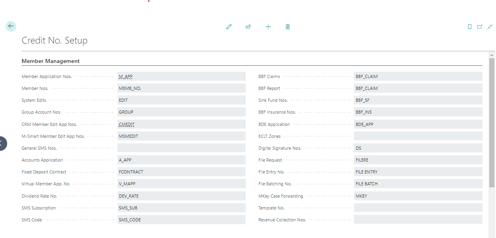
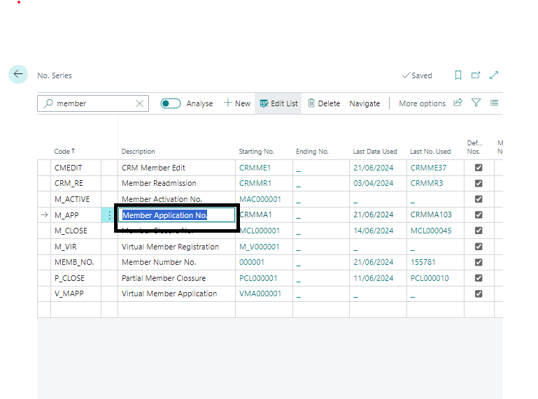
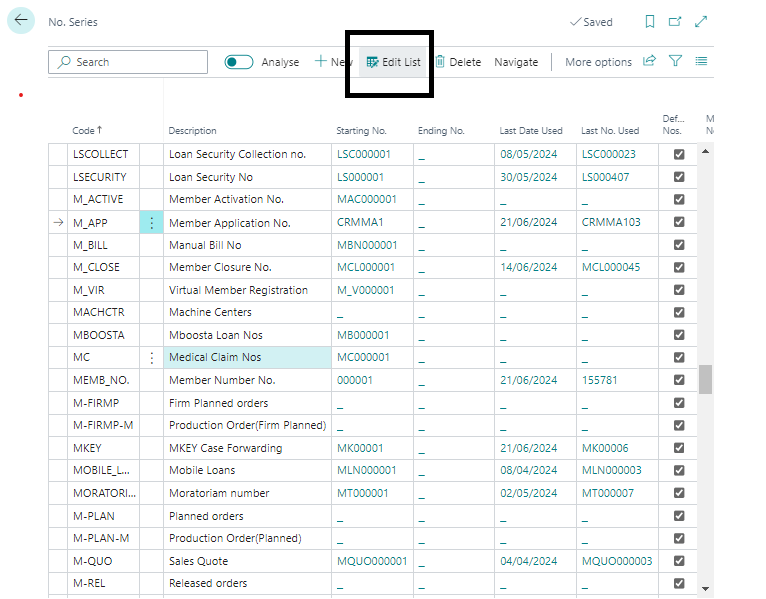
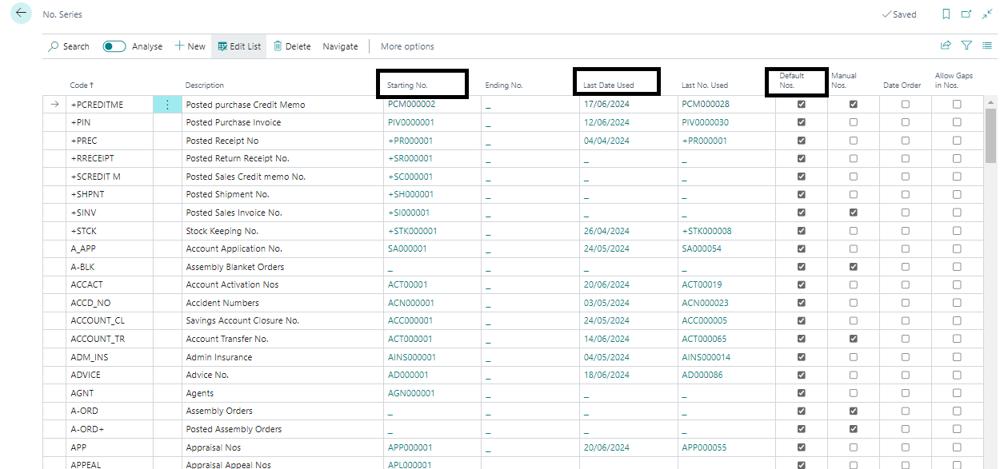
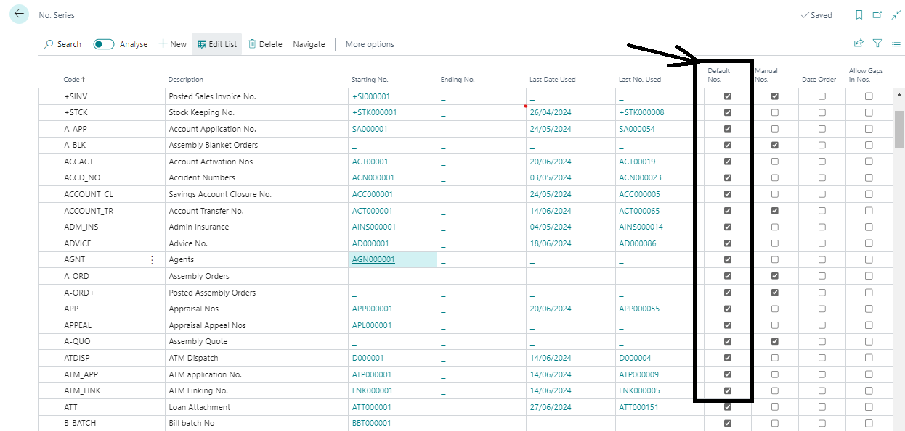

# Credit Number Series Setup
---

    
Welcome to the Credit Number Setup User Manual! This guide will walk you through setting up and managing number series for credit processes in Business Central.

---

### Overview
---

The Credit Number Setup in Business Central is essential for managing and tracking all credit-related processes and items using predefined number series. It ensures that every process, such as Member Applications, is uniquely identified and sequentially numbered.

:::info Accessing Credit Number Setup Page
---

To access the Credit Number Setup Page:
1. Navigate to the Credit Management module in Business Central where credit processes are managed.
2. Locate and open the Credit Number Setup Page.

:::
---

### Setting Up Number Series
---

Setting up a number series is crucial for automatic numbering and tracking of credit processes. Here’s how you can set up a number series, using Member Application Number as an example:

1. **Navigate to Number Series List:**
   - Click on the down arrow next to the relevant field (e.g., Member Application Number).

   

2. **Edit Number Series:**
   - You will be directed to the No. Series List.
   - Click on **Edit List** on the Page Ribbon.

   

3. **Configure Number Series:**
   - Input the **Starting Date** for the number series.
   - Specify the **Starting Number** from which the sequence should begin.
   - Fill in the **Increment By No** field to determine the increment value between consecutive numbers.

   

<!--  -->

4. **Save Configuration:**

5. **Enable Automatic Numbering:**
   - Check the **Default Nos** field to enable automatic numbering. This field is not editable once checked.
   - Automatic numbering ensures that the No. field in any credit process page is auto-generated and incremented when the page is opened.

   

### Using Automatic Numbering
---

Once configured, the number series will automatically generate and increment numbers for all related credit processes. This streamlines data entry and ensures accuracy in tracking transactions.

---
:::tip Additional Tips

- **Manual Input:** If the **Default Nos** field is not checked, you will need to manually input numbers into respective cards for each process.
- **Verification:** Always verify the settings and ensure the correct number series is applied before initiating any credit process.
:::
---

The Credit Number Setup simplifies the management of credit processes by automating the generation and incrementing of numbers. By following the steps outlined in this guide, you can effectively set up and maintain accurate numbering for seamless operations in Business Central.

---

**Enjoy the convenience of automatic numbering with Credit Number Setup in Business Central for efficient credit management!**
