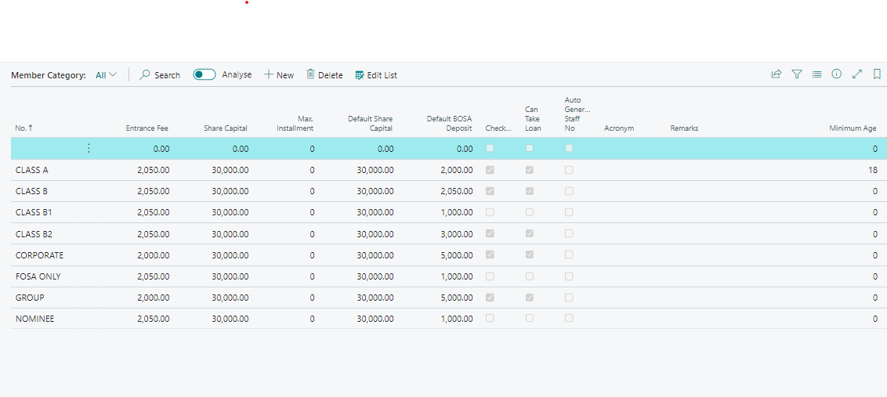
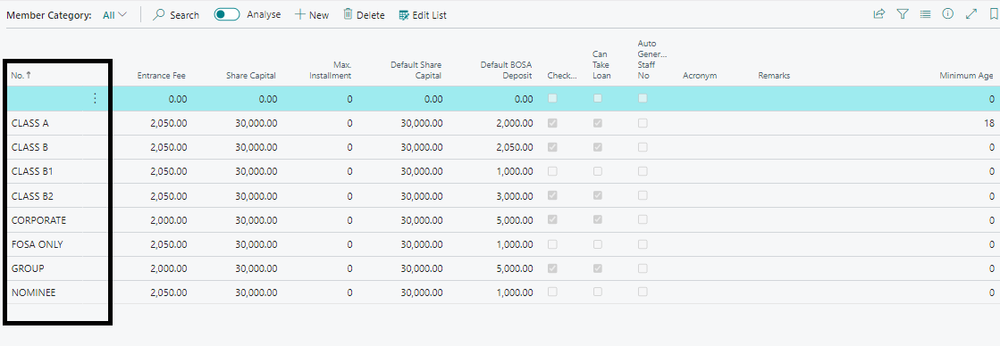

# Member Category Setup
---

    
Welcome to the Member Category Setup User Manual for Mwalimu National DT Sacco! This guide will assist you in setting up and managing different member categories with specific features and benefits related to savings and credit products.

---
### Overview
---

Instutions such as Sacco's offers various member categories to cater to different needs and preferences of its members. Each category comes with unique features and benefits tailored to enhance member experience with savings and credit products.

---
### Accessing Member Category Setup
---

To access the Member Category Setup:
1. Localte the search icon on the top right corner and search for **Member Categories**.
2. Locate and open the Member Category Setup Page.

---

---
### Setting Up Member Categories
---

Follow these steps to set up member categories with their respective features and benefits:

1. **Navigate to Member Category Setup:**
   - Access the Member Category Setup Page.

2. **Define Member Categories:**
   - Create different categories i.e - based on your SACCO's membership structure.

   

3. **Specify Features and Benefits:**
   - For each category, define specific features and benefits related to savings and credit products offered by the institution (Sacco).

4. **Save Configuration:**
---
:::tip Additional Considerations
---

- **Editing Member Categories:** Use the edit options available to modify existing member category details as needed.
- **Deleting Member Categories:** If necessary, remove categories that are no longer relevant or in use.
:::
---

Setting up Member Categories allows for tailored offerings that meet the diverse financial needs of members. By following the steps outlined in this guide, you can effectively manage and enhance member engagement through differentiated savings and credit products.

---
