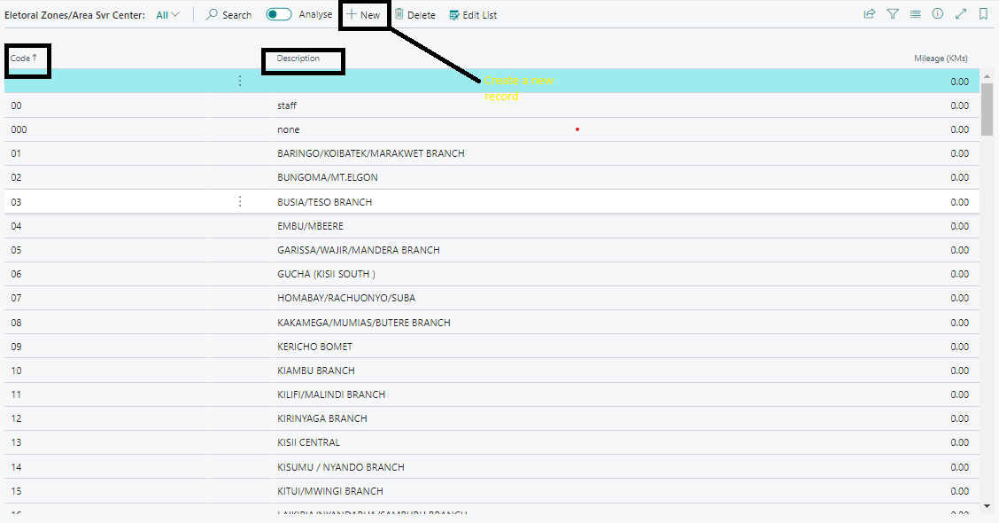
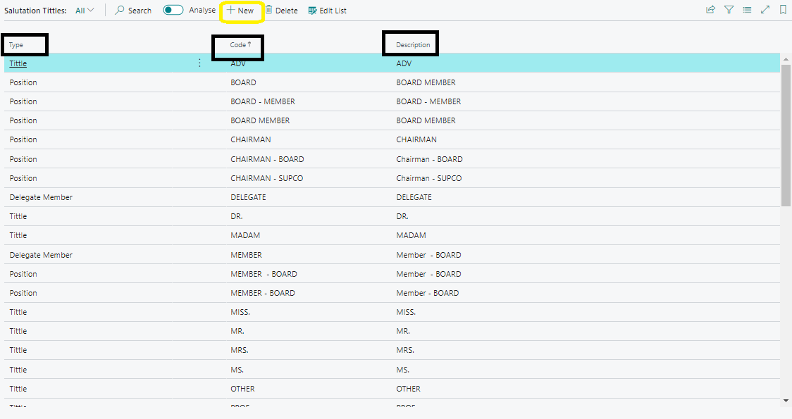
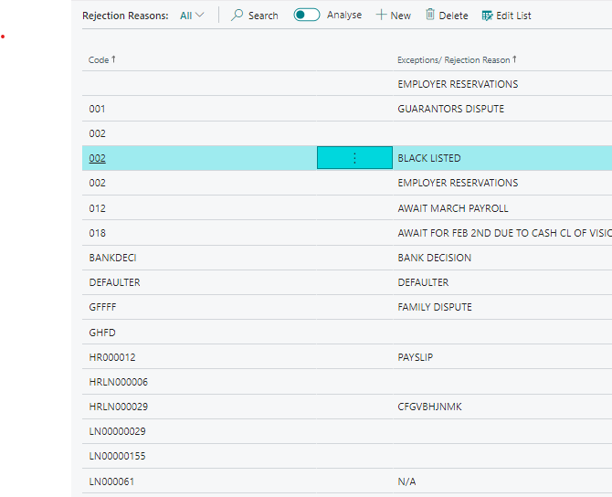

# Setting Up Electoral Zones, Salutation Titles, and Rejection Reasons
---

### Electoral Zones and Area Service Centers
---

Electoral Zones and Area Service Centers are used to categorize members geographically within the Sacco.

- ### Accessing Electoral Zones
---

To access Electoral Zones:
- Go to **Settings** at the top right corner.
- Navigate to **General** > **Setup** > **Electoral Zones**.

- ### Creating a New Electoral Zone or Area Service Center
---

1. Click on **New** on the Electoral Zones page.
2. Choose the **Type** as either Electoral Zone or Area Service Center.
3. Enter a unique **Code** for the zone.
4. Provide a brief **Description**.

- ### Deleting a Record
---

To delete a record:
- Select the record from the list.
- Click **Delete** on the toolbar.

---
### Salutation Titles Setup
---

Salutation Titles customize titles for different positions within Mwalimu National DT Sacco.

---
- ### Accessing Salutation Titles
---

To access Salutation Titles:
- Navigate to **General** > **Setup** > **Salutation Titles**.

---
- ### Creating New Salutation Titles
---

1. Click on **New** on the Salutation Titles page.
2. Select the **Type** (Title, Position, or Delegate Committee).
3. Enter a **Code** for the title.
4. Describe the title in the **Description** field.

---
- ### Deleting a Record
---

To delete a record:
- Select the record from the list.
- Click **Delete** on the toolbar.

---
### Rejection Reasons Setup
---

Rejection Reasons categorize reasons for rejecting processes or requests within Mwalimu National DT Sacco.

---
- ### Accessing Rejection Reasons
---

To access Rejection Reasons:
- Navigate to **General** > **Setup** > **Rejection Reasons**.

---
- ### Creating New Rejection Reasons
---

1. Click on **New** on the Rejection Reasons page.
2. Enter a **Code** for the rejection reason.
3. Describe the reason in the **Rejection Reason** field.

---
- ### Deleting a Record
---

To delete a record:
- Select the record from the list.
- Click **Delete** on the toolbar. 

---
