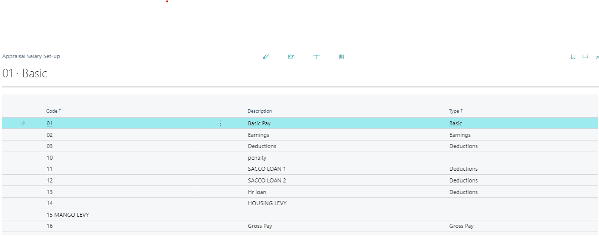
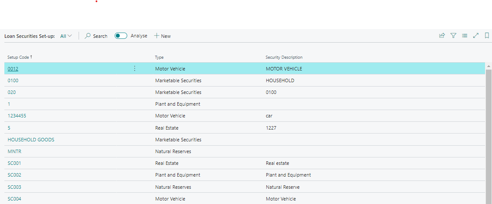

# Appraisal Salary Setups
---

    
Salaries are a crucial parameter in the Loaning process. The Appraisal Salary Setup feature allows you to configure salary information, including earnings, deductions, and basic salaries. This user manual will guide you through the setup process step by step.

---

### Loan Securities Setup
---
### Accessing the Appraisal Salary Setup Page
---

### Navigate to the Page
---

1. **Open Microsoft Dynamics Business Central**.
2. **Search for “Appraisal Salary Setup”** or find it in the **Credit Management group** within the **Setup section**.

---

### Loan Securities Setup Page
---

Once you’re on the “Loan Securities Setup” page, you’ll see the following options:

- ### Creating a New Loan Security
---

- ### Click “New” on the Page Ribbon
---

This action will take you to the “Loan Securities Card.”

:::important Important Note

Before applying for a loan, ensure that you’ve created the necessary loan securities in Microsoft Dynamics Business Central. These securities will be available for selection during the loan application process, especially when choosing guarantors and security.
:::

---

- ### Fill in the Details
---

Here are the fields you need to complete:

1. **Code**: Enter the code for the loan security (e.g., “Car”).
2. **Description**: Provide a brief description (e.g., “Motor Vehicle”).
3. **Example**: Add an illustrative example.
4. **Type (Dropdown)**: Choose from options like:
   - Real Estate
   - Plant and Equipment
   - Natural Reserves
   - Marketable Securities
   - Inventory
   - Motor Vehicle
5. **Category (Dropdown)**: Select from:
   - Cash Government Securities
   - Corporate Bonds
   - Equity
   - Mortgage Securities
   - Lien
   - Motor Vehicle
   - Others
6. **Collateral Multiplier (Integer)**: Input a numeric value.
7. **Blocked (Boolean)**: Indicate whether the security is blocked.
8. **Last Date Modified**: This will be automatically updated.
9. **Revaluation Frequency**: Specify how often revaluation occurs.

---
By following these steps, you can efficiently set up loan securities and ensure they are available for selection during the loan application process.

---
