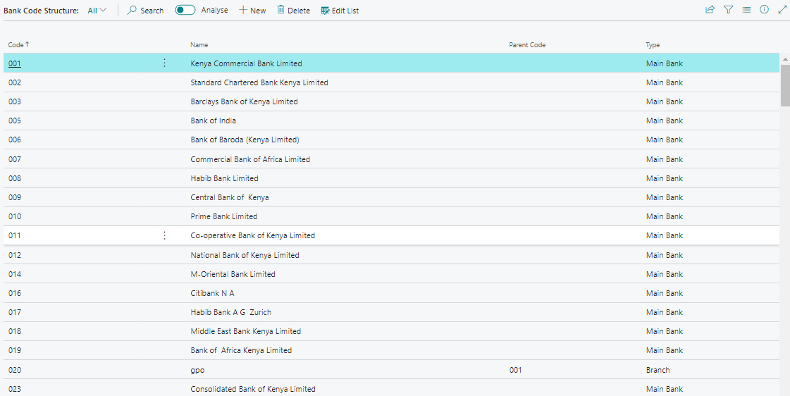
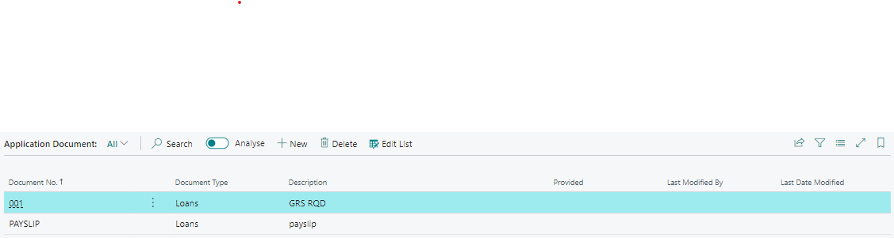
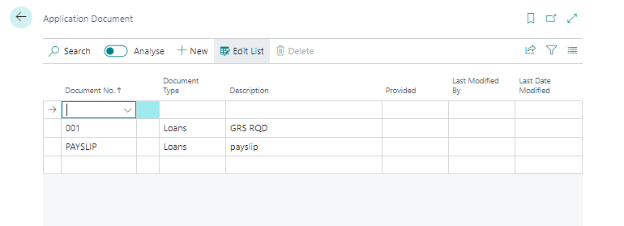
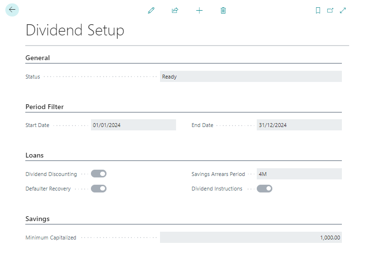
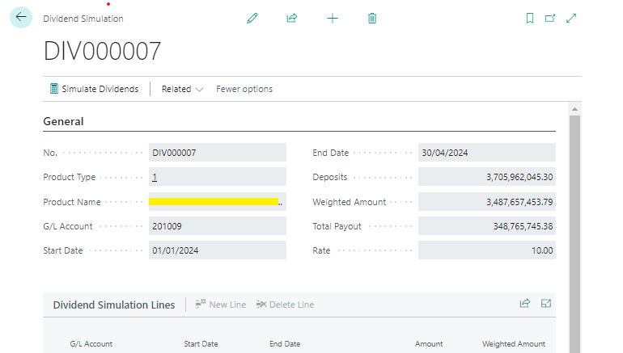

# Bank Code Structure & Dividend Setups
---

    
This user manual provides detailed guidance on setting up and managing Bank Code Structures, Application Documents, and Dividend Setups in Microsoft Dynamics Business Central. Follow the steps outlined below to ensure efficient configuration and utilization of these features.

---

### Bank Code Structure
---

### Overview
---

The Bank Code Structure page is designed for setting up banks and their respective branches.

### Accessing the Bank Code Structure Page
---

1. **Navigate to the Page:**
   - Open Microsoft Dynamics Business Central.
   - Search for **Bank Code Structure** or find it in the General group.

2. **Creating a New Bank Record:**
   - Click `New` on the page ribbon to create a new record.
   - Fill in the following fields accurately:
     - **Bank Code**
     - **Bank Name**
     - **Branch Code**
     - **Branch**

---
- ### Deleting a Bank Record
---

1. Select the record you want to delete.
2. Click `Delete` on the page ribbon.

---
- ### Exiting the Bank Code Structure Page
---

Click the arrow at the top left corner to exit the page.

---
### Application Documents
---
Application documents include the necessary paperwork for membership and loan applications for members.

---
### Accessing the Application Documents Page
---

1. **Navigate to the Page:**
   - Open Microsoft Dynamics Business Central.
   - Search for "Application Documents" or find it in the General group within the Setup module.

2. **Creating a New Document:**
   - Click `New` on the page ribbon.
   - You will be directed to the Application Doc. Setup Card page.
   - Fill in the following details:
     - **Document No.**
     - **Description**
     - **Retiree Document (Boolean)**
     - **Document Type** (Member, Loan, Account)
     - **Member Type** 
     - **Memberships** 

---
- ### Deleting an Application Document Record
---

1. **On the Application Documents Page:**
   - Select the record you want to delete.
   - Click `Delete` on the page ribbon.

2. **On the Application Doc. Setup Card:**
   - Click the delete option on the card (first from the right).

---
### Dividend Setup
---
The Dividend Setup is used during dividend processing. Each field plays a specific role in guiding the system on how to handle dividend calculations and distributions.

---
### Configuring Dividend Setup
---

2. **Start Date:**
   - Indicates the beginning of the period range for dividend calculation.

3. **End Date:**
   - Indicates the last day of the period range for dividend calculation.

4. **Dividend Discounting:**
   - Check this box if recovery of issued dividend discounting facilities is intended during processing.

5. **Defaulter Recovery:**
   - Check this box if recovery of defaulted facilities is intended during processing.

6. **Loan Arrears Recovery:**
   - Check this box if recovery of loan arrears is intended during processing.

7. **Dividend Instructions:**
   - Enforces adherence to customer dividend proceeding instructions preset on the Customer card. Check this box if enforcement is required.

8. **Minimum Capitalized:**
   - Sets the minimum amount of dividends that can be disbursed to customer accounts. Amounts below this limit will be capitalized as deposits.

9. **Transaction Type:**
   - Select the charge to be levied on dividend processing and posting. These charges are preset and selected during setup.

---

By following these steps, you can efficiently set up and manage Bank Code Structures, Application Documents, and Dividend Setups within Microsoft Dynamics Business Central.

---
