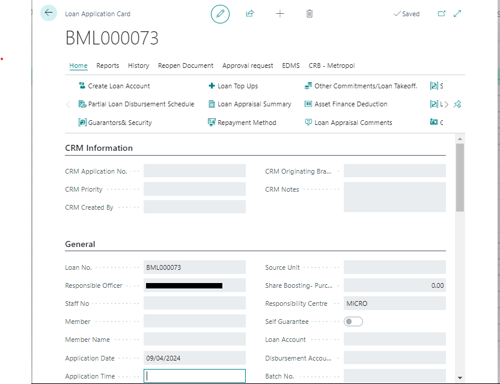

# Loan-application
---

:::note Business Central

    

        
The Loan Application process within Microsoft Dynamics Business Central is essential for managing loan requests efficiently. Below, we’ll guide you through the steps and details involved in applying for a loan through our SACCO system.🤗

    

:::
---

### Accessing Loan Application
---
To access the Loan Application:
- Search for ‘Loan Application’ in Microsoft Dynamics Business Central.
- Alternatively, navigate through the Credit Management Role Center:
  - Click on ‘Loans’ in the Navigation Menu.
  - Select ‘Loans Processing’ from the Navigation bar.
  - Choose ‘Loan Application List’.

  

---
### Loan Processing Stages
---

Under ‘Loan Processing’, various lists categorize loan applications based on their stage:
- **Loan Application List:** Displays ongoing loan applications.
- **Loan Appraisal List:** Shows appraised loans against SACCO credit policies.
- **Loan Approved List:** Lists approved loan applications.
- **Loan Disbursement List:** Displays open loan disbursements.
- **Rejected Loan Application List:** Lists rejected loan applications.

---

#### Loan Application List Page
---

To apply for a new loan:
- Click ‘New’ on the Loan Application List page ribbon.
- To delete a loan application, click ‘Delete’ on the Loan Application List page ribbon.
- Edit a loan application by clicking ‘Edit’ on the Loan Application List page.

---
#### Loan Application Card
---

The Loan Application card is divided into three Fast Tabs:

1. **General**
   - **Loan No.:** Automatically generated loan application number.
   - **Application Date:** Date when the loan application is submitted.
   - **Member:** Dropdown list of active SACCO members.
   - **Member Name, Staff No., Member Deposits:** Auto-filled based on selected member.
   - **Loan Product Type:** Select from available loan products.
   - **Loan Product Type Name, Interest Calculation Method:** Auto-filled based on selected loan product.
   - **Recovery Mode:** Select repayment option.
   - **Appraisal Parameter, Retirement/Expiry:** Auto-populated details.
   - **Installments, Interest:** Auto-filled with editable options.
   - **Amount Applied, System Recommended Amount:** Application and qualified amounts.
   - **Amount to Disburse:** Amount to be disbursed during disbursement.
   - **Comments for Exemption, Remarks:** Additional information.
   - **CRB Rating, BDE Type, Loan BDE:** Credit rating, BDE details.
   - **Loan Appraised By, Approved By:** Staff IDs involved.
   - **Department Code, Project Code:** Global dimensions.
   - **Share Boosting:** Option to boost member deposits.
   - **Responsibility Center:** Responsible application area.
   - **Self-Guarantee:** Indicates self-guaranteed loans.
   - **Loan Account, Disbursement Account:** Auto-generated and member-specific accounts.
   - **Batch No., Repayment, Loan Principle Repayment:** Disbursement and repayment details.
   - **Discounted Account, Mode of Disbursement, Disbursement Destination:** Additional disbursement options.
   - **Captured By, Details Verified By:** Staff IDs for data entry and verification.
   - **Repayment Frequency, Disbursement Date, Repayment Start Date, Expected Date of Completion:** Repayment and completion schedule.
   - **Status, Loan Rejection Reason:** Application status and reasons for rejection.

---

