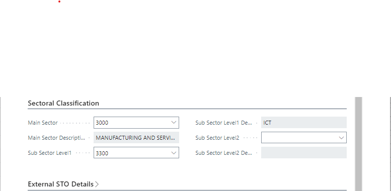
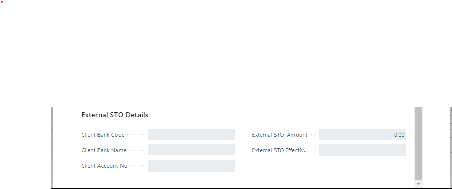

# Sectoral Classification and External STO Details
---

### Sectoral Classification Fast Tab
---

The Sectoral Classification Fast Tab captures detailed information about the purpose of the loan application.

- **Main Sector:**
  - **Purpose:** Select the main sector from the dropdown list on the 'Main Sector' List page that best fits the loan application.
  - Automatically populated after selecting the main sector.

- **Sub Sector Level 1:**
  - **Purpose:** Choose the sub-sector related to the main sector from the dropdown list on the 'Sub Sector Level 1' List page.
  - Automatically populated after selecting the sub-sector level 1.

- **Sub Sector Level 2:**
  - **Purpose:** Select the specific purpose tied to sub-sector level 1 from the dropdown list on the 'Sub Sector Level 2' List page.
  - Automatically populated after selecting the sub-sector level 2.

---
### External STO Details Fast Tab
---

The External STO (Standing Order) Details Fast Tab is relevant only if the Recovery Mode is set to 'External STO'. Here, you can input details related to external standing orders.

- **Client Bank Code:**
  - **Purpose:** Select the member's bank from the dropdown on the 'Bank Code Structure' list page.
  - **Auto-fill:** Once the bank code is selected, this field is automatically filled with the corresponding bank name.

- **Client Account No.:**
  - **Purpose:** Enter the member's bank account number accurately.

- **External STO Amount:**
  - **Auto-generated:** The system automatically generates this amount.

- **External STO Effective Date:**
  - **Purpose:** Select the appropriate date for the standing order's effectiveness from the dropdown.

---
