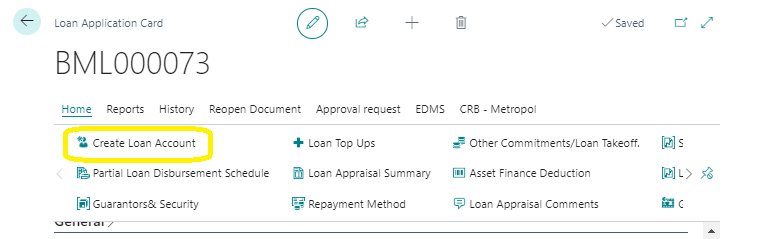
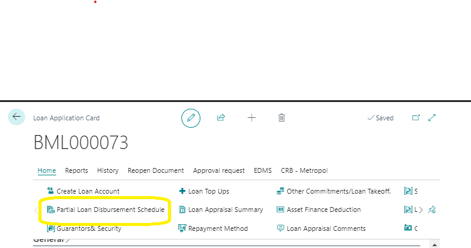
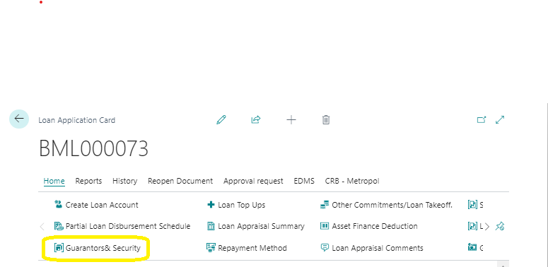
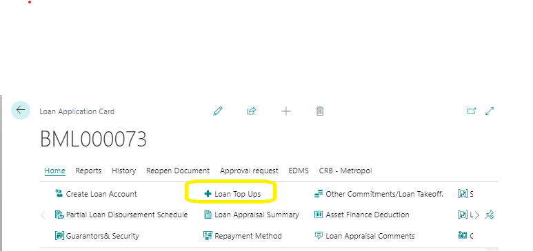
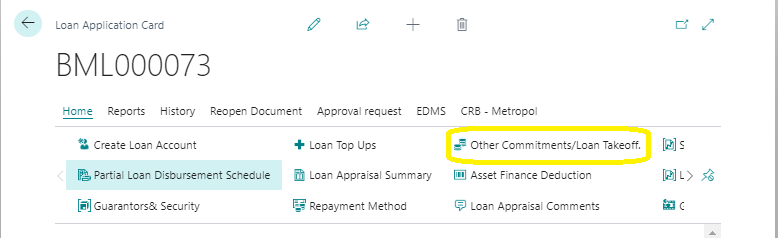
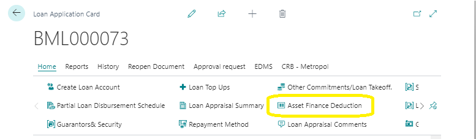
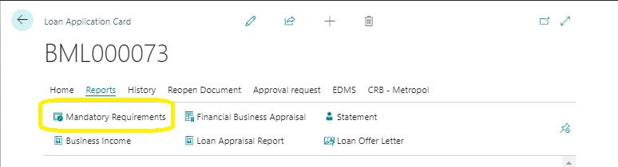
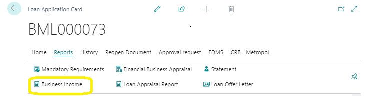
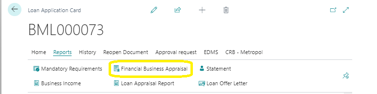

# Ribbon Actions in Loan Application
---
:::note Business Central

    

        
The Loan Application card in Microsoft Dynamics Business Central provides various actions on the ribbon to manage and process loan applications effectively. Each action serves a specific purpose to aid in the loan application and approval process.🤗

    

:::
---

### Ribbon Actions Overview
---

---
#### Process Action Group
---

1. **Create Loan Account**
   - **Purpose:** Initiates the creation of a loan account.

     
2. **Partial Loan Disbursement Schedule**
   - **Purpose:** Available when 'Mode of Disbursement' is set to 'Partial Disbursement'. Opens the 'Partial Loan Disbursement Schedule' page to schedule disbursements.

    
3. **Guarantors and Security**
   - **Purpose:** Opens the 'Guarantors and Security' page to capture loan guarantors and security details.
   - **Details:**
     - Select from options like Collateral, Guarantor, or Lien in the 'Guarantor Type' dropdown.
     - The 'Savings Account No/Member' field lists relevant members or collateral items based on selection.

  
  
4. **Loan Top Ups**
   - **Purpose:** Opens the 'Loan Top-ups' page to manage additional loan requests.

  
5. **Repayment Method**
   - **Purpose:** Displays the selected loan repayment method from the loan application card.
   
6. **Other Commitment/Loan Takeoff**
   - **Purpose:** Opens the 'Other Commitment Clearance' page to offset external payments.
   - **Details:**
     - Use the dropdown in 'Vendor No.' to select vendors from Microsoft Dynamics Business Central.
     - Input amount and monthly deduction.

   

7. **Asset Finance Deduction**
   - **Purpose:** Opens the 'Asset Finance Deduction' page for asset finance loan details.
   - **Details:**
     - Use the dropdown in 'Vendor No.' to select vendors from Microsoft Dynamics Business Central.
     - Input amount and monthly deduction.

   

<!-- 9. **Loan Collaterals**
   - **Purpose:** Opens the 'Loan Collaterals' page for capturing collateral details.
   - **Details:** Manually fill out collateral information provided by the member.

   - **Screenshot:** Include a screenshot of the 'Loan Collaterals' page. -->
   
10. **Mandatory Requirements**
    - **Purpose:** Opens the 'Mandatory Requirements' list page to manage required application documents.
    - **Details:**
      - Use dropdown to select relevant documents; descriptions are auto-filled.
      - Select 'Single', 'Multiple', or 'Business' for document type.

    

11. **Business Income**
    - **Purpose:** Opens the 'Business Income' page for self-employed members or business owners.
    - **Details:** Loan appraisal based on business income.

    

12. **Financial Business Appraisal**
    - **Purpose:** Leads to the 'Financial Business Appraisal' page for conducting financial appraisals.

    

---
<!-- 13. **Post Advance**
    - **Purpose:** Enables post-advance actions for loans without batching requirements.
    
14. **Discount Loan**
    - **Purpose:** Initiates a discounted loan process before the disbursement waiting period elapses.
    
15. **Loan Payment Schedule**
    - **Purpose:** Displays the loan payment schedule for installment repayments.
    
16. **Post Loan**
    - **Purpose:** Visible in the process group actions ribbon after loan approval. -->

---