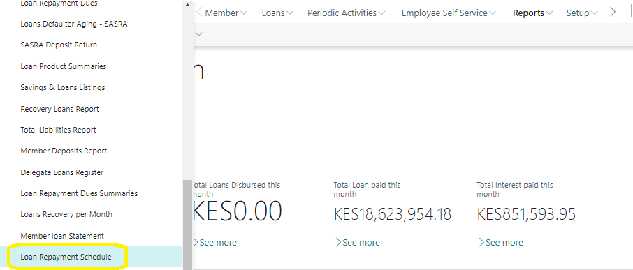
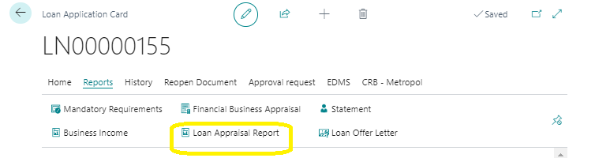
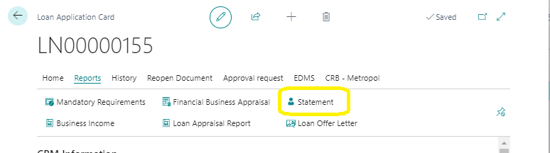

# Loan Application Reports
---

    
In Microsoft Dynamics Business Central, several reports aid in managing and analyzing loan applications. These reports provide detailed information and evaluations essential for the loan application process.

---

### Reports Overview
---

#### 1. Generate Repayment Schedule
---
**Purpose:** The Loan Repayment Schedule Report displays comprehensive loan repayment information, including:
- Repayment dates
- Installments
- Amount per installment from the first to the last installment

**Details:** This report helps in tracking and managing the repayment schedule of loans, ensuring that both the SACCO and its members are clear on repayment obligations.

---
<!-- #### 2. Business Evaluation Report
---
**Purpose:** The Business Evaluation Report appraises self-employed members applying for loans. It assesses their business performance and financial stability.

**Details:** 
- Evaluates the member's business income and expenses
- Assesses the potential risk and repayment capability of the business
- Provides a detailed analysis used to support loan approval decisions

**Screenshot:**  -->

#### 2. Loan Appraisal Report
---
**Purpose:** The Loan Appraisal Report is run to appraise a member based on set appraisal parameters for a specific loan application. It provides a visual analysis and evaluation of factors influencing the loan decision.

**Details:**
- Analyzes appraisal parameters such as credit score, income, and existing debts
- Helps determine the system recommended loan amount
- Ensures fair and consistent loan evaluation

---

#### 3. Statement Report
---
**Purpose:** The Statement Report summarizes and displays a member’s financial status, including:
- Share Capital
- Deposits
- Loan information

**Details:** 
- Provides a comprehensive view of a member's financial interactions with the SACCO
- Helps members and SACCO staff understand the overall financial position and loan status of the member

---
