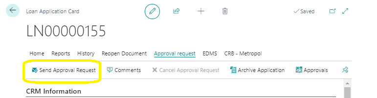
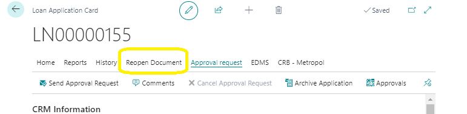
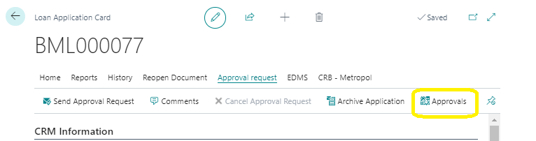
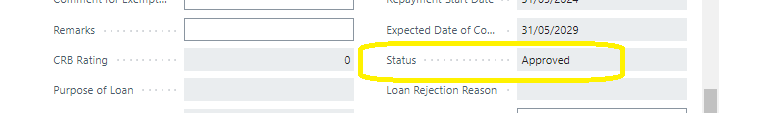

# Loan Application Approvals Request Features
---

### Sending an Approval Request
---

To send a document for approval, simply click the **'Send Approval Request'** button. This action will forward the document to the appropriate parties for their review and approval.

---
### Re-Opening a Document
---

If you need to make changes to an already approved loan application, click the **'Re-Open Document'** button. This will reset the status to 'Application', allowing you to modify the loan application as needed.

---
### Accessing Approvals
---

To view all approval information, click on the **'Approvals'** button. This will take you to the Approvals page, where you can see detailed information about all pending and completed approvals.

---
### Steps to Complete and Send a Loan Application for Approval
---

1. Fill out the Loan Application card with all the required information.
2. Use the actions available on the ribbon to complete any additional necessary steps.
3. Click the **'Send for Approval'** button.

If the status of the loan application changes to approved, it will automatically appear on the Loan Approved List, indicating that the approval process is complete.

---
