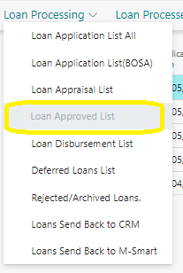
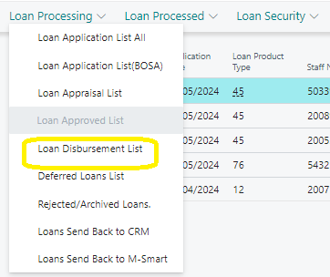
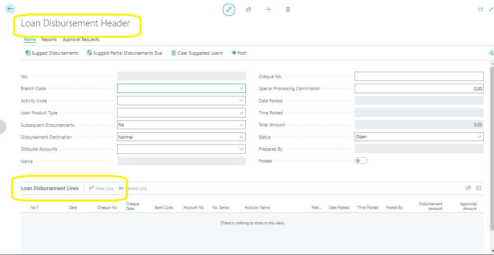

# Navigating to Approved Loans and Loan Disbursements
---

### Approved Loan
---

To access the **Loan Approved List** in the Credit Management Role Center, follow these steps:

1. Click on **‘Loans’** in the Navigation Menu.
   <!--  -->
2. Click on **‘Loans Processing’** on the Navigation bar.
   <!--  -->
3. Click on **‘Loan Approved List’**.

---
### Loan Disbursement
---

To navigate to the **Loan Disbursement** in the Credit Management Role, follow these steps:

1. Click on **‘Loans’** in the Navigation Menu.
   <!--  -->
2. Click on **‘Loans Processing’** on the Navigation bar.
   <!--  -->
3. Click on **‘Loan Disbursement List’**.

---
### Creating a New Loan Disbursement
---

To create a new loan disbursement batch, follow these steps:

1. Click **‘New’** on the Loan Disbursement List page.
   <!--  -->
2. A new **‘Loan Disbursement Header’** page will open.
   <!--  -->

The Loan Disbursement Header consists of three main sections:
- The Fast Tab
- The Lines
- The Page Ribbon

---
### Fields on the Loan Disbursement Header
---

Below is a table detailing the fields found on the Loan Disbursement Header:

| Field                         | Description                                                                 |
|-------------------------------|-----------------------------------------------------------------------------|
| **No.**                       | This is the Batch Number that is autogenerated on opening the Loan Disbursement Header page. |
| **Department Code**           | This is Global Dimension 1.                                                 |
| **Project Code**              | This is Global Dimension 2.                                                 |
| **Loan Product Type**         | Enter the approved loan product type from the drop-down list.               |
| **Subsequent Disbursements**  | Select ‘No’ for full disbursement or ‘Yes’ for partial disbursement.        |
| **Disbursement Destinations** | Select the appropriate destination for the loan money.                      |
| **Disbursement Account**      | This field depends on the selected Disbursement Destination.                |
| **Name**                      | The name of the disbursement account.                                        |
| **Cheque No.**                | Input the cheque number.                                                    |
| **Special Processing Commission** | Any additional charges and commissions.                                  |
| **Date Posted**               | This will be filled out after posting.                                      |
| **Time Posted**               | This will be filled out after posting.                                      |
| **Total Amount**              | The total amount to be disbursed to the destination account.                |
| **Status**                    | The status of the Loan Disbursement.                                        |
| **Prepared by**               | ID of the staff in charge of the Loan Disbursement.                         |
| **Posted**                    | Boolean field, defaults to false until posted, then set to true.            |

---
---
### Fields on the Loan Disbursement Lines
---

Below is a table detailing the fields found on the Loan Disbursement Lines:

| Field              | Description                                                                           |
|--------------------|---------------------------------------------------------------------------------------|
| **No.**            | This is the Batch Number generated for the Loan Disbursement.                         |
| **Date**           | The date when the Loan Disbursement is initiated.                                      |
| **Cheque No.**     | Displays the Cheque number for the loan batch.                                         |
| **Cheque Date**    | The date on the Cheque for the specific loan batch.                                    |
| **Bank Code**      | The Bank Code of the destination bank.                                                 |
| **Account No.**    | The Loan Account Number created during the Loan Application.                           |
| **No Series**      | Displays the number series for the process.                                            |
| **Account Name**   | Equivalent to the Loanee’s name.                                                       |
| **Posted**         | Boolean field to indicate whether the Loan Disbursement has been posted or not.        |
| **Date Posted**    | This will be filled out after posting.                                                 |
| **Time Posted**    | This will be filled out after posting.                                                 |
| **Posted By**      | ID of the staff in charge of posting the Loan Disbursement.                            |
| **Disbursement Amount** | The amount to be disbursed.                                                       |
| **Approved Amount** | The approved loan amount.                                                             |
| **Department Code** | This is Global Dimension 1.                                                           |
| **Loan No.**       | Displays the Loan Number.                                                              |
| **Project Code**   | This is Global Dimension 2.                                                            |
| **Line No.**       | Displays the Line number for the transaction’s entry.                                   |

---
