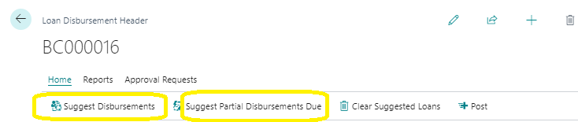
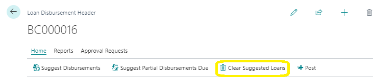
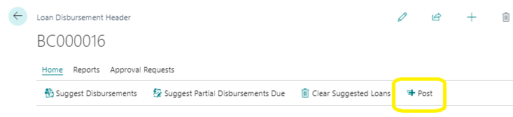
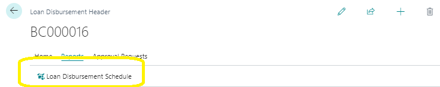
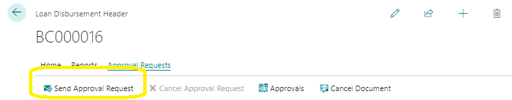
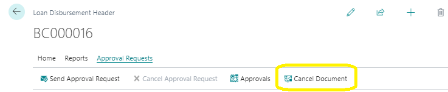

# Loan Disbursement Header Actions
---

    
This guide will help you navigate and use the actions available on the Loan Disbursement Header page. You'll learn how to process, report, and request approvals for loan disbursements efficiently.

---

### Actions on the Loan Disbursement Header Page Ribbon
---

The Loan Disbursement Header page ribbon has three main categories of actions: Process, Report, and Approval. Each category includes specific actions detailed below.

---
### 1. Process
---

---
#### a. Suggest Disbursements
---

To display all loans with the current **‘Loan Disbursement Header’** Batch Number, click on **‘Suggest Disbursements’**. This will populate the Disbursement Lines with the relevant loans.

---
#### b. Suggest Partial Disbursements Due
---

If you want to display only the loans set for partial disbursement, click on **‘Suggest Partial Disbursements Due’**. This will show loans with the current Batch Number that have their disbursement mode set to partial.

---
#### c. Clear Suggested Loans
---

To clear all the suggested loans from the Disbursement Lines, click **‘Clear Suggested Loans’**. This action will remove all previously suggested loans.

---
#### d. Post
---

When you are ready to finalize the transactions, click **‘Post’**. This will execute the transactions and post them to the Bank Account ledger entries.

---

---
### 2. Report
---

---
#### Loan Disbursements Schedule
---

To run the **‘Loan Disbursements Schedule’** report, click on the **‘Loan Disbursements Schedule’** action. This will generate the report for you.

---
### 3. Approval
---

---
#### Send Approval Request
---

To send an approval request for the Loan Disbursement Header, click **‘Send Approval Request’**. This action forwards your request for approval.

#### Cancel Document
---

If you need to reopen an approved document, click **‘Cancel Document’**. This will change the document's status from approved to open, allowing for further modifications.

---
## To Disburse a Loan
---

Here's a step-by-step guide to disbursing a loan:

1. **Enter the Batch Number**: Go to the approved loan application and enter the loan number of the loan you've just created. Use the drop-down menu in the loan number field to select the correct Loan Disbursement Header.

   <!--  -->

2. **Exit Approved Loan Card**: Use the arrow at the top left to exit the Approved Loan Card.

   <!--  -->

3. **Suggest Disbursements**: Return to the Loan Disbursement Header Card and click **‘Suggest Disbursements’**. This will generate the lines on the Disbursement Lines page part.

   <!--  -->

4. **Verify Details**: Check that the details on the lines match those on the Loan Approved card.

5. **Send Approval Request**: Send an approval request for the Loan Disbursement Header.

6. **Confirmation Prompt**: Click **‘Yes’** when asked **‘The lines will be deleted and recreated. Are you sure you want to proceed?’**.

   <!--  -->

7. **Run Loan Disbursement Schedule**: Run the Loan Disbursement Schedule report.

   <!--  -->

8. **Post the Loan Disbursement**: Click **‘Post’** on the page ribbon to finalize the loan disbursement.

   <!--  -->

---
By following these steps, you can efficiently manage loan disbursements and ensure all processes are correctly followed.

---
