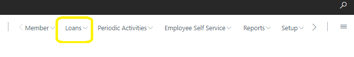
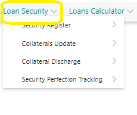
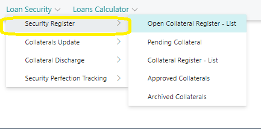
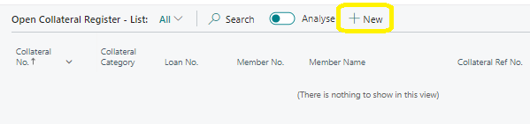
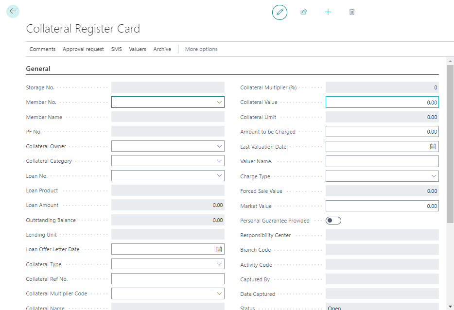
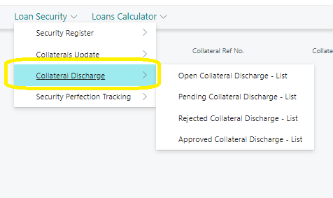

# Loan-security-guide
---

:::note Business Central

    

        
This guide provides instructions for managing Loan Security within the Credit Management Role Center. You will learn how to navigate to Loan Security, create and manage Collateral Registers, and handle Collateral Collections effectively..🤗

    

:::
---

### Accessing Loan Security
---

To access Loan Security:

1. Navigate to **‘Loans’** on the Credit Management Role Center using the Loans Navigation Menu.
   

2. Click on **‘Loan Security’** on the **‘Loans’** Navigation Bar.
   

---
### Security Register List
---
To view the Security Register:

1. Click on **‘Security Register ’** to access the details.

2. To create a new Collateral Register entry, click **‘New’** on the Collateral Register page list to open a new Collateral Register card.

3. Fill out the Collateral Register Card with the necessary details.

4. Send the Collateral Register Card for approval. Once approved, exit the card using the arrow at the top left.

5. To delete a Loan Collateral, click on the delete (trash icon) available on the page card. Alternatively, delete it from the list page by selecting the loan collateral and clicking delete on the list page ribbon.

---
### Collateral Discharge - List
---

This list tracks the returned collateral to their owners.

To register a collateral return:

1. Open the Collateral Discharge card.

   
2. Select the collateral number intended for return and input any necessary remarks.

3. Request approvals for the collateral return.

---

By following these steps, you can effectively manage Loan Security, ensuring proper handling of Collateral Registers and Collateral Collections.

---
