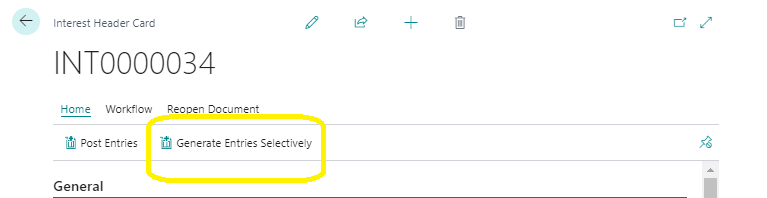
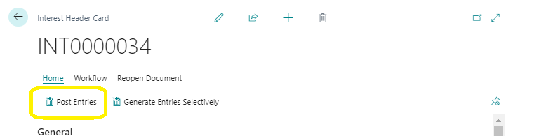

# Periodic Activities
---
:::note Business Central

    

        
Periodic activities are essential processes that occur repeatedly within your SACCO. These activities ensure smooth operations and accurate financial management. In this user manual, we’ll explore the key periodic activities, step by step.🤗

    

:::
---

### 1. Monthly Interest
---

Monthly interest is a crucial task for managing loan accounts. It involves two main processes: Interest Due Periods and the Billing List.

---
#### Interest Due Periods
---

**Accessing Interest Due Periods:**
- Navigate to the Credit Management Role Center in Microsoft Dynamics Business Central.
- Click on Periodic Activities in the Loans Navigation Menu.
- Select Monthly Interest from the Navigation Bar.

**Setting Up Interest Due Periods:**
- Define and manage interest due periods within the year.
- Typically, interest due runs every month, resulting in twelve periods annually.
- Create new interest periods using the New option on the Interest Due Periods list page.

**Deleting a Period:**
- If needed, delete specific periods by selecting them and clicking Delete on the List Page ribbon.

---
### 2. Billing List
---

- ### Understanding Interest Billing
---
- The Interest Billing process generates a list of loan accounts with outstanding balances.
- You can apply interest charges to these accounts based on predefined rates and calculation methods.

- ### Creating an Interest Billing List:
---
- Click New on the Billing List.

- An Interest Header Card will open.
- Fill out the required fields (e.g., interest rates, calculation methods).

- ### Generating Entries:
---
- Click Generate Entries and wait for all entries to be generated.

- ### Approval and Posting:
---
- Send an Approval Request for the Interest Header Card.

- Finally, Post the Interest Billing to complete the process.

---
