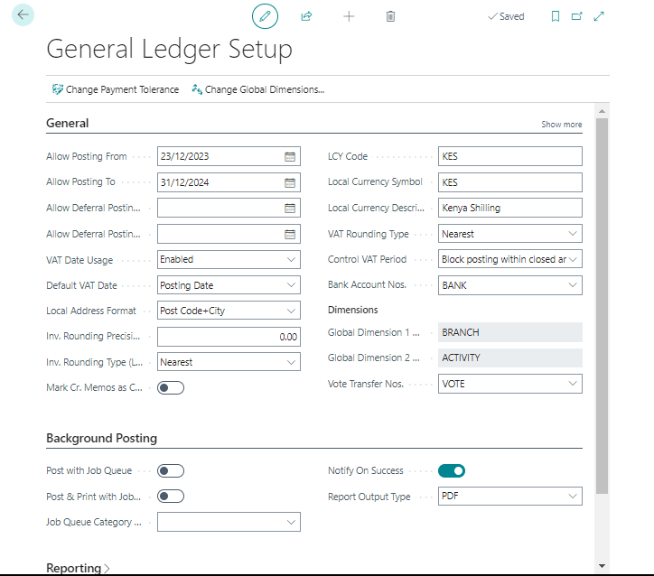

# General Ledger Setup
---

:::note Business Central

    

        
On the General Ledger Setup page, you can specify default settings for the general ledger and other application areas. It's essential to complete the general ledger setup for each company you establish in Microsoft Dynamics 365 Business Central.🤗

    

:::
---

#### FastTabs on General Ledger Setup Page
---

1. **General**
2. **Dimensions**
3. **Background Posting**
4. **Reporting**
5. **Application**

---

#### To access the General Ledger Setup page:
---
1. Select the Search for Page icon in the upper-right corner of the page.
2. Enter "general ledger setup."
3. Select the related link.
---

---
