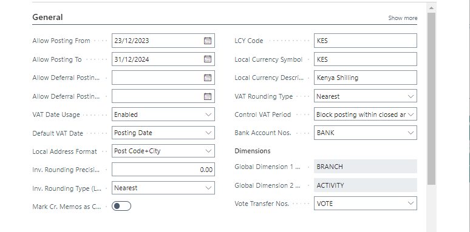

# General FastTab Setup
---

    
The General FastTab serves as the cornerstone of basic setup defaults in your accounting system, ensuring a solid start to your financial journey. Let's delve into its key components:

---

#### Allow Posting From/Allow Posting To
---
- These fields establish a date range for transaction posting, safeguarding the integrity of financial records by restricting entries outside this period.

#### Local Address Format
---
- Dictates the appearance of addresses on printouts, offering flexibility to tailor formats based on countries. Enabling the 'Require Country/Region Code in Address' field ensures dynamic changes in ZIP Code, City, and State based on selected Country/Region Code, enhancing address accuracy.

#### Local Currency Settings
---

:::info Here, you define your company's local currency and related settings:
---
- **LCY Code:** Specifies the local currency.
- **Invoice (Inv.) Rounding Precision and Type:** Determines how invoice amounts are rounded.
- **Amount Rounding Precision and Decimal Places:** Specifies rounding intervals and decimal places for amounts.
- **Unit-Amount Rounding Precision and Decimal Places:** Controls rounding for unit amounts.
- **Local Currency Symbol and Description:** Defines symbols and descriptions for the local currency.
- **Tax/VAT Rounding Type:** Governs rounding of tax/VAT amounts for consistency.
:::
---

#### Bank Account Nos. and Bank Rec. Adj. Doc. Nos.
---
- These fields manage bank account numbering and reconciliation adjustment document numbers, ensuring organized banking operations.

#### Bank Recon. with Auto. Match
---
- Toggles between two reconciliation methods, offering flexibility based on your reconciliation needs.

#### Enable Data Check
---
- Controls data validation for accuracy during document and journal entries, minimizing errors and ensuring data integrity.

Each setting acts as a cornerstone, laying the foundation for efficient financial management within your Business Central system.

---
