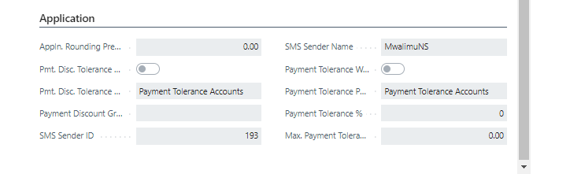
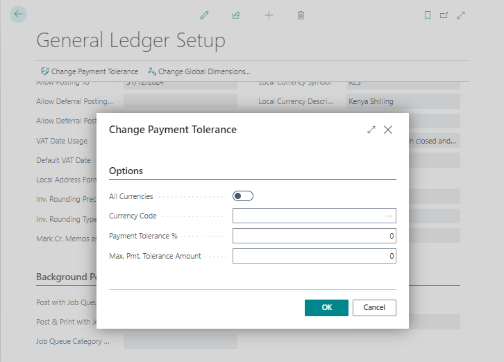

# Application FastTab SetUp
---

    
Configuring the Application FastTab is essential for specifying settings related to currency rounding tolerance and payment application. Here's how to set it up:

---

#### Currency Rounding Tolerance
---

- The Application FastTab allows you to define the currency rounding tolerance, which determines the interval for rounding differences in the local currency (LCY) when applying LCY entries to entries in a different currency.

#### Payment Application Settings
---

You can also configure how payments are applied to outstanding amounts, including payments from customers and payments to vendors. The Application FastTab contains the following fields for this purpose:

- **Appln. Rounding Precision:** Specifies the interval size for rounding differences for LCY entries applied to entries in a different currency.
- **Payment Disc. Tolerance Warning, Payment Disc. Tolerance Posting, and Payment Discount Grace Period:** Complete these fields to allow tolerances on payment discount terms.
- **Payment Tolerance Warning and Payment Tolerance Posting:** Specify settings to close outstanding receivables and payables with payment amounts that differ from the amount owed.
- **Payment Tolerance %:** Enter the percentage by which a payment or refund can differ from the amount on the invoice or credit memo.
- **Max. Payment Tolerance Amount:** Define the maximum amount by which a payment or refund can differ from the amount on the invoice or credit memo.

---

---

#### Changing Payment Tolerance
---

To adjust the payment tolerance, follow these steps:

1. On the General Ledger Setup page, select **Actions > Functions > Change Payment Tolerance**.
2. Check the **All Currencies** checkbox if you want to use the same payment tolerance settings for local and foreign currencies.
3. Leave the **Currency Code** field blank to set up payment tolerances for the local currency, or specify foreign currencies on the Currency Card page.
4. Enter a percentage and amount in the respective fields for Payment Tolerance.
5. Select **OK** to execute the Change Payment Tolerance batch job.

---

---
