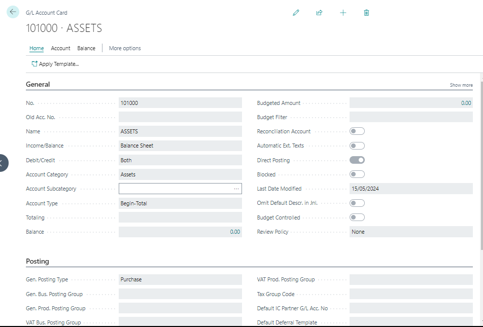

# G/L Account Setup
---

    <h2 class="product-variations"> Setting up G/L Account</h2>
    
G/L (General Ledger) accounts are essential for financial management. Here's how to set them up:

---

#### G/L Account Card
---

- Each G/L account has a G/L Account Card with five FastTabs:

1. **General**
2. **Posting**
3. **Consolidation**
4. **Reporting**
5. **Cost Accounting**

#### Creating a New G/L Account
---

- To create a new G/L account:

1. Go to **Chart of Accounts**.
2. Click **New**.
3. Expand the **General FastTab**. 

---

| Field                | Description                                     | Demonstration Data  |
|----------------------|-------------------------------------------------|---------------------|
| No.                  | G/L account number                              | 613500              |
| Name                 | Description of the account                      | Telephone expenses  |
| Income/Balance       | Classification                                  | Income Statement    |
| Account Category     | Category of the G/L account                      | Expense             |
| Account Subcategory  | Subcategory of the account category             | Utilities Expense   |
| Debit/Credit         | Type of entries                                 | Both                |
| Account Type         | Purpose of the account                          | Posting             |
| Totaling             | Account interval or list of account numbers     |              |
| Balance              | Current balance of the account                  | -                   |
| Reconciliation       | Include in Reconciliation list                   | No                  |
| Automatic Ext. Texts | Automatically add extended text to documentation | No                  |
| Direct Posting       | Allow direct posting from journal lines         | Yes                 |
| Blocked              | Prevent entries from posting to this account     | -                   |
| Last Date Modified   | Date of the last modification                   | System generated    |
| Omit Default Descr. | Skip default description in journal lines        | -                   |
| Review Policy        | Specify how to allow reviews of G/L entries     | -                   |

---

1. Fill in the necessary fields in the **Posting FastTab**.

2. Save the account.

---

Accurate setup of G/L accounts ensures precise financial reporting.

---
