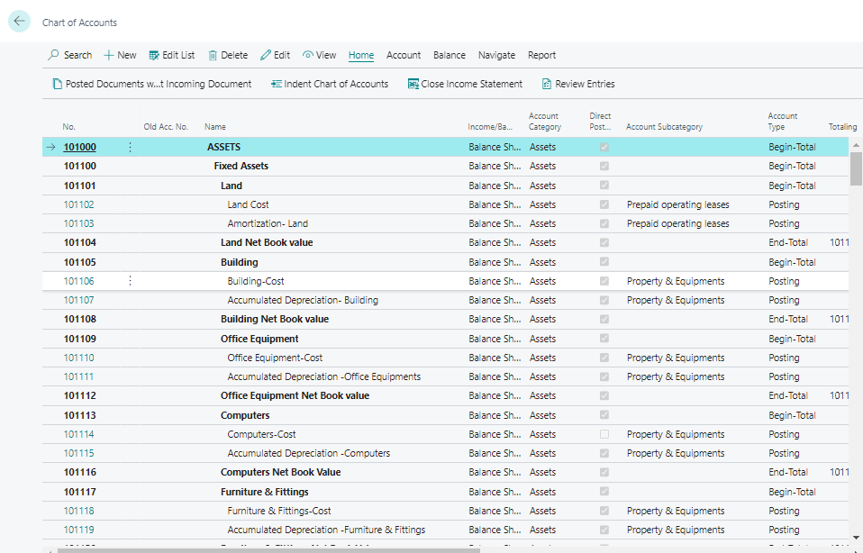

# Using the Chart of Accounts
---

    
The Chart of Accounts is crucial for managing financial data. Here's how to use it effectively:

---

#### Chart of Accounts Page
---

1. **Viewing Accounts**: The Chart of Accounts displays ledger accounts.

2. **Accessing Accounts**: Open individual G/L accounts directly from the chart.

3. **Editing Accounts**: Use "Edit List" to update existing or create new G/L accounts.

4. **Drilling Down**: Click on "Net Change" or "Balance" to view ledger entries.

#### Chart of Accounts Overview
---

1. **Overview Page**: Provides a simplified version of the chart.

2. **Basic Information**: Displays net changes and balances for all G/L accounts.

3. **Collapsible Rows**: Rows for account type Begin-Total can be collapsed.

4. **Bookmarking**: Easily access the Overview page from your role center.

By utilizing both pages, you can efficiently manage financial information.

---
