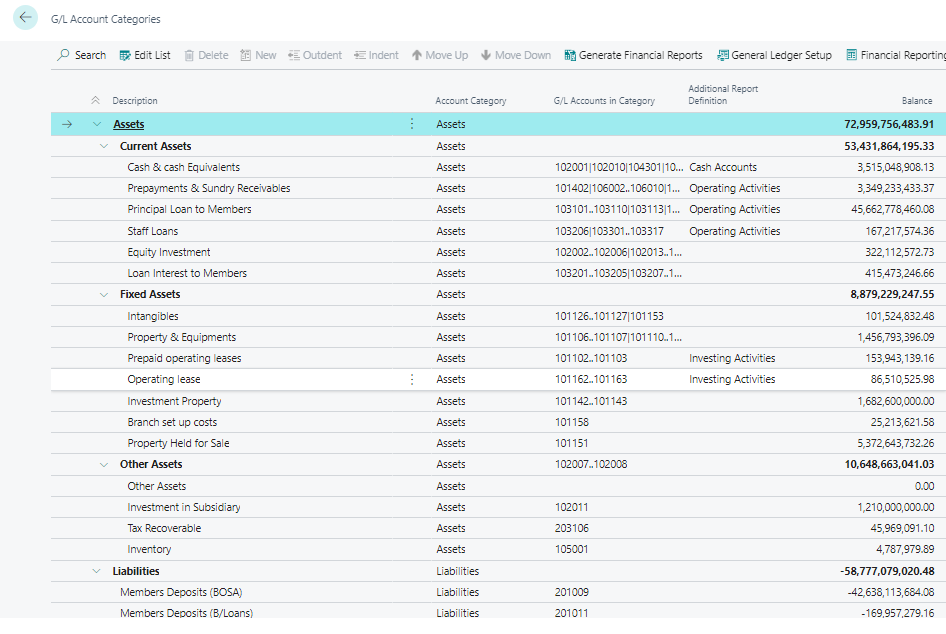

# Account Categories
---

    
To personalize financial statements and create reports effectively, follow these steps to set up account categories and subcategories:

#### Assigning Categories:
---

1. **Mapping Accounts**: Map general ledger accounts to G/L account categories to structure financial statements.

2. **Financial Reports**: Use categories and subcategories to generate reports like the balance sheet, income statement, cash flow statement, and retained earnings report.

3. **Available Categories**: Assign one of the following categories to a G/L account:
   - Assets
   - Liabilities
   - Equity
   - Income
   - Cost of Goods Sold
   - Expense

#### Creating Subcategories:
---

1. **Access Categories**: Go to G/L Account Categories through the Search for Page icon.

2. **Customization**: Create new subcategories and assign them to existing accounts for detailed organization.

3. **Category Groups**: Indent subcategories to create category groups, simplifying the overview by showing total balances.

4. **Example**: Group fixed assets and current assets separately for clarity.

#### Reporting Options:
---

1. **Additional Report Definition**: Specify if accounts in each subcategory should be included in specific types of reports:
   - Operating Activities
   - Investing Activities
   - Financing Activities
   - Cash Accounts
   - Retained Earnings
   - Distribution to Shareholders

By effectively utilizing categories and subcategories, you can tailor financial reporting to your organization's needs.

---
