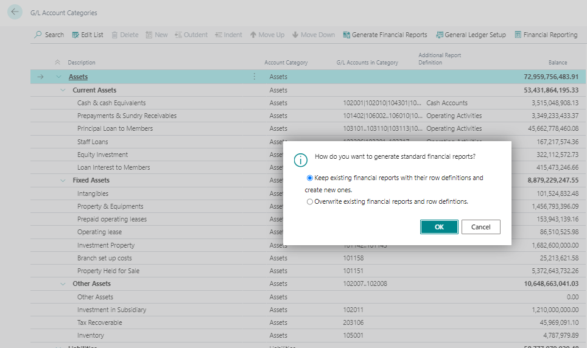

# Setting Up Financial Reports with Account Categories
---

    
To personalize financial statements and create reports effectively, follow these steps to set up account categories and subcategories:

---

#### Generating Account Schedules:
---

1. **Access G/L Account Categories**: Select the Search for Page icon and enter "G/L account categories," then select the related link.

2. **Generate Account Schedules**: On the G/L Account Categories page, > Generate Account Schedules.

3. **Specify Preferences**: Choose whether to create new account schedules or replace existing ones, then select OK.

Business Central will create account schedules using the following fields from the G/L Account Categories page:
- Account Category
- Additional Report Definition

#### Specifying Account Schedules:
---

1. **General Ledger Setup**: Navigate to the General Ledger Setup page, where the account schedules are specified on the Reporting FastTab.

2. **Accessing Reports**:
   - **Account Schedules Page**: Search for "account schedules" and choose the related link. Select an account schedule, then Process > Overview.
   - **Role Center**: Go to Reports > Financial Statements to print financial statements directly from your role center.

:::note
---
Financial statements may not be available in all role centers; typically, access is granted to roles requiring financial information, such as Business Managers and Accountants.
:::

---
