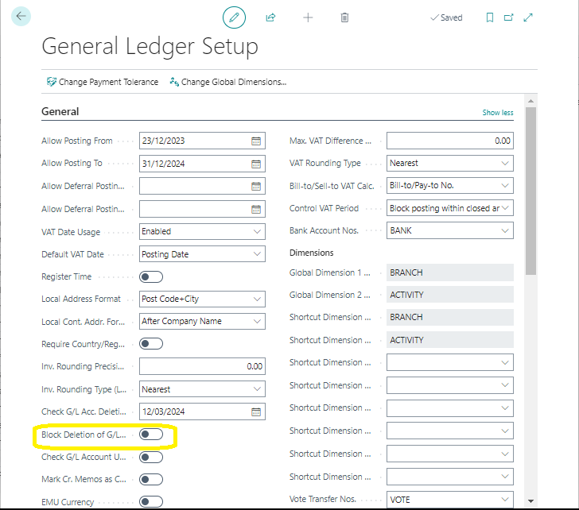
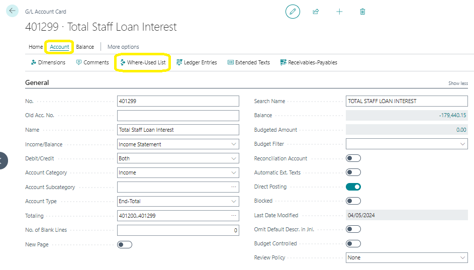

# Chart of Accounts Maintenance
---

    
Welcome to the user manual for maintaining the chart of accounts! Below are the steps and considerations you should follow to effectively manage your accounts:

---

#### Overview:
---

1. **Add or Modify Accounts:** You may need to add new accounts or modify existing ones to reflect changes in your financial structure.

2. **Delete Accounts:** Occasionally, you might need to delete accounts that are no longer relevant. However, there are rules to follow before doing so.

3. **Consult the Where-Used List:** This feature helps you identify where specific accounts are used within your setup tables.

---

#### Adding or Modifying G/L Accounts:
---

- Typically, you can add or modify General Ledger (G/L) accounts through the G/L account card. Alternatively, you can use the Chart of Accounts list.
  
- To access the Chart of Accounts list:
  - Select the Search for Page icon and enter **chart of accounts.**
  - Choose the related link and then select **Manage** followed by **Edit List.**

- You can then:
  - Create a new G/L account: Select **New** and fill in the necessary fields.
  - Modify an existing account: Locate the account and make the required changes.

---

#### Deleting G/L Accounts:
---

:::note Before deleting an account, ensure:
---
  - The account balance is zero.
  - There are no ledger entries in the current fiscal year.
:::

- You can set additional conditions to prevent accidental deletion by adjusting settings in the General Ledger Setup:
  - Navigate to **general ledger setup** through the Search for Page icon.
  - Expand the **General FastTab** and select **Show more** to view all fields.

:::note Consider:
  - Enabling **Check G/L Account Usage** to protect accounts used in setup tables.
  - Setting a date in **Check G/L Acc. Deletion After** to control when accounts can be deleted.
::: 

---

- To block deletion entirely, turn on the **Block Deletion of G/L Accounts** toggle.

---

#### Consulting the Where-Used List:
---

- This feature helps you understand where a specific G/L account is utilized.
- To access it:
  - Search for **chart of accounts.**
  - Select a G/L account, then go to **Edit** > **Account** > **Where-Used List.**

---

Follow these steps diligently to maintain your chart of accounts effectively and avoid unintended consequences. Happy accounting!

---
