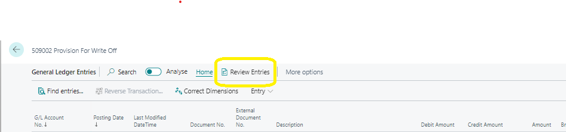

# Reviewing General Ledger Entries
---

    
To expedite the period-end process of reviewing and reconciling G/L accounts, you have the option to review the G/L entries and mark them as Reviewed. Whether you can review the general ledger entries for a specific G/L account depends on the Review Policy field setting on the General FastTab of the G/L account card.

---

For G/L accounts where reviewing is enabled, you can follow these steps to review general ledger entries:

1. **Access General Ledger Entries:**
   - Click on the Search for Page icon in the upper-right corner of the page.
   - Enter "General Ledger Entries" and select the related link.

2. **Select Entries to Review:**
   - Choose "Review Entries."
   - On the page displayed, select the entries that you have reviewed.

3. **Mark Entries as Reviewed:**
   - After selecting the entries, choose the **Set selected as reviewed** option.

By marking entries as reviewed, the system will automatically update the **Reviewed By** field with the username and the **Reviewed Date** field with the date and time of completion.

If needed, you can also use the **Set selected as not reviewed** option to clear the Reviewed field for the selected entries.

This process streamlines the review and reconciliation of general ledger entries, facilitating smoother period-end procedures.

---
