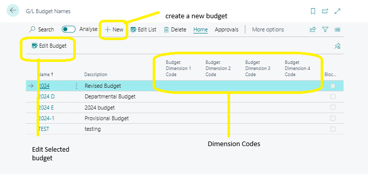

# Creating Budgets Manually
---

:::note Business Central

    

        
A budget serves as a roadmap for planned expenses and revenues, playing a crucial role in business intelligence by providing a benchmark to gauge actual financial performance against forecasts..🤗

    

:::
---

With the Budget feature in Business Central, you gain the ability to:

- Create multiple budgets spanning identical time periods.
- Generate both simple and intricate budgets by selecting combinations of G/L accounts, periods, two global dimensions, and four budget dimensions.
- Easily copy budgets from previous periods and adjust actual or budget figures using adjustment factors.
- Seamlessly import and export budgets to and from Excel.

---

When initiating the budgeting process, the first step involves creating a unique budget name. Here's a breakdown of key steps and considerations:

- **Creating Budget Names:**
  - Establish distinct budget names on the G/L Budgets page to manage multiple budgets within the same time frame.

- **Dimension Setup:**
  - Decide whether to incorporate dimensions into your budgets.
  - Two global dimensions are universally available across all budgets.
  - Each budget can include up to four additional budget dimensions for detailed analysis.

:::info Business Central
Utilizing budget dimensions enhances your ability to filter and add dimension information to budget entries, allowing for comparisons akin to sales and purchases postings. For instance, you can compare actual sales figures across different regions with budgeted sales figures.
:::

---

To set up a G/L budget, follow these straightforward steps:

1. **Access G/L Budgets:**
   - Use the Search for Page icon in the top-right corner of the page.
   - Enter **G/L budgets** and select the related link.

2. **Create a New Budget:**
   - Select **New**.
   - Input a unique identifier and a brief description in the respective fields.
   - Choose relevant dimensions from the drop-down list in the **Budget Dimension Code** field.

Further modifications can be made by double-clicking on the budget line or selecting **Edit Budget**.

---
