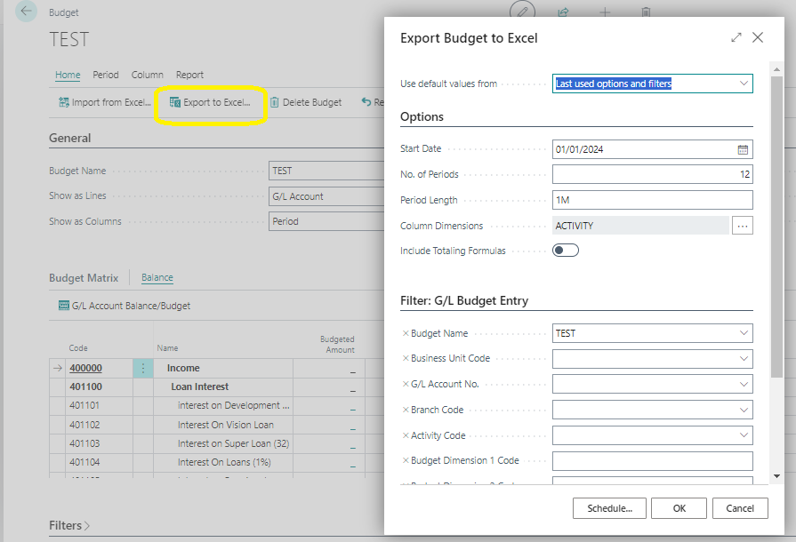
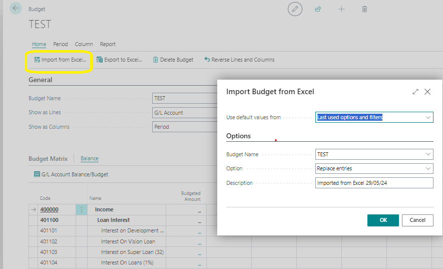

# Export and Import Budgets
---

    
In Business Central, you have the option to create budgets using export and import functions. This feature allows for efficient management and manipulation of budget data.

---

### Exporting Budgets to Excel
---

You can export budgets to Excel using the Export Budget to Excel batch job. When budgets are exported, you can perform the following tasks:

- Utilize Excel to modify and add to the budget.
- Create new budgets based on the exported budget figures.

---

### Importing Budgets from Excel
---

Similarly, you can import budgets from Excel using the Import Budget from Excel batch job. This process offers various possibilities:

- Import previously exported budgets from Business Central into an existing or new budget.
- Create new budget entries by replacing existing entries.
- Add budget entries to an existing budget.

Before importing a budget from Excel, it's recommended to export a budget from Business Central to ensure the correct format.

---

### Important Considerations
---

- The chart of accounts, which G/L budgets are based on, consists of lines of account type Heading that contain the total of the lines below it. When exporting a G/L budget, data on all lines is exported regardless of the account type.
  
- However, data of the account type Heading cannot be imported back in. When selecting the **Add entries** option on the Import Budget from Excel batch job, any values on Heading lines will be ignored. By selecting the **Replace entries** option, any values that already existed on Heading lines will also be deleted.

These functionalities enable seamless management of budgets, facilitating effective financial planning and analysis within your organization.

---