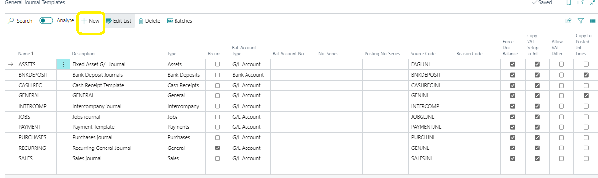

# Setting Up General Journal Templates
---

:::note Business Central

    

        
In this user manual, you'll learn how to set up general journal templates to efficiently manage financial transactions. With these templates, you can streamline processes like purchasing, paying, or refunding employee expenses. Let's dive in!🤗

    

:::
---

### Introduction
---

Most financial transactions are recorded in the general ledger through dedicated business documents. However, Business Central offers the flexibility to process various business activities through journal lines in different journals. Before you start, it's essential to set up journal templates and batches.

---

### Getting Started
---

To set up a new general journal template in Business Central, follow these steps:

1. **Navigate to General Journal Templates**:
   - Click on the Search for Page icon in the top-right corner.
   - Enter "general journal templates" and select the related link.

2. **Create a New Template**:
   - Fill in the required fields:
     - *Name and Description*: Provide a unique name and a brief description for the template.
     - *Type*: Choose the appropriate journal type from the available options.
     - *Bal. Account Type and Bal. Account No.*: Identify the default balancing account.
     - *No. Series and Posting No. Series*: Determine the default number series for document numbering.
     - *Source Code*: Automatically generated based on the journal type.
     - *Reason Code*: Describe the purpose of the entry.

3. **Additional Options**:
   - *Force Doc. Balance*: Specify whether entries must balance by document number and type.
   - *Copy VAT/TAX Setup to Jnl. Lines*: Automatically fill in VAT details on journal lines.
   - *Increment Batch Name*: Automatically increment batch names.
   - *Allow VAT/TAX difference*: Control manual adjustment of VAT amounts.
   - *Copy to Posted Jnl. Lines*: Specify whether journal lines should be copied to posted journal lines.

---

Setting up general journal templates in Business Central allows for efficient management of financial transactions. By following these steps, you can tailor templates to your specific business needs, improving accuracy and productivity.

---
