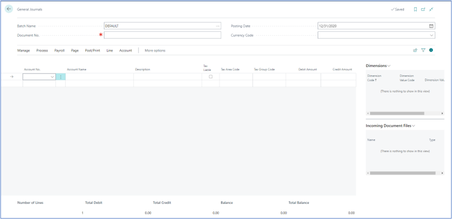
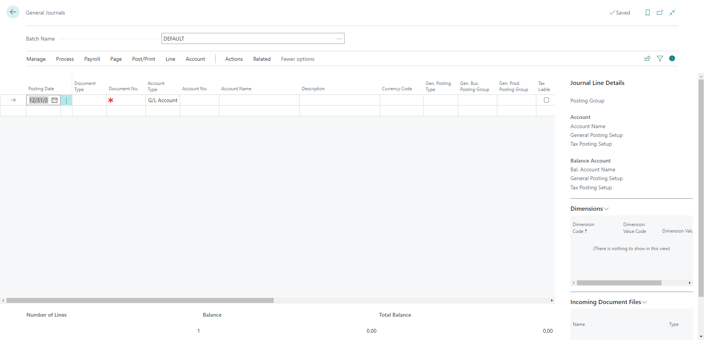

# Creating Journal Entries
---

:::note Business Central

    

        
General journals provide a straightforward way to record financial transactions. You can post entries to various accounts like bank, customer, vendor, and employee accounts.🤗

    

:::
---

### Creating a Journal Entry
---

To create a new journal entry, follow these steps:

1. **Access General Journals**:
   - Click on the lookup icon.
   - Enter "general journals" and select the related link.

2. **Choose Layout**:
   - The General Journal page offers both simplified and advanced layouts.

---

3. **Simplified Layout**:
   - In the simplified layout, the document number, posting date, and currency code are displayed on the headers. 
   - On the lines, you'll find the following fields:
     - Account No.
     - Account Names
     - Description
     - Debit Amount
     - Credit Amount
   - Use this layout for fast entry of basic journal lines.

---

4. **Advanced Layout**:
   - The advanced layout displays less frequently used fields.
   - To switch from the simplified to the advanced layout, select **Page** from the action menu and then choose **Show More Columns**.

---

### Posting Entries
---

- If default balancing accounts are set for journal batches, they will be filled in automatically when you enter the Account No. 
- Otherwise, you can fill in the Account No. and Bal. Account No. fields manually.
- Positive amounts in the Amount field are debited to the main account and credited to the balancing account, while negative amounts are credited to the main account and debited to the balancing account.

---

Creating journal entries in Business Central is simple and efficient. By following these steps and utilizing the appropriate layout, you can accurately record financial transactions in your organization.

---
