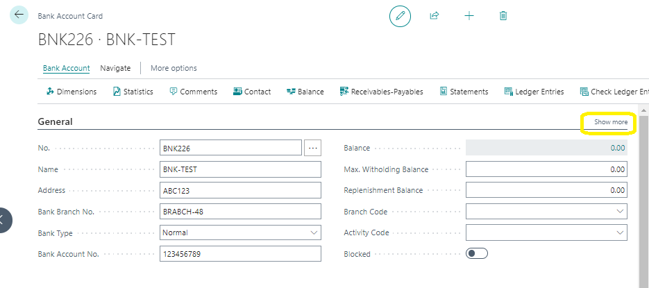

# Setting Up Bank Accounts
---

    
Ready to get your cash management sorted in Business Central? Let's start by setting up your bank accounts so you can smoothly handle customer and vendor payments.Creating bank account cards for each account you want to manage in Business Central is the first step. You can even add customer and vendor bank accounts to make outgoing payments a breeze.

---

- We'll also cover setting up payment methods and registration, so you're fully equipped for all your financial tasks.

- Once you've got your bank accounts set up, you'll be able to track them in any currency and even print checks if needed.

### Let's Get Started!
---

Ready to set up your bank account for manual transactions? Here's how:

1. Click the Search for Page icon in the top-right corner, type in Bank Accounts, and hit enter.
2. In the Bank Accounts window, hit New.
3. Add a number in the No. field or let the system assign one for you.
4. Enter the bank's name in the Name field.
5. Fill in the bank branch number and account number in the General FastTab.
6. Hit Show more to reveal all the fields on the General FastTab.

7. If you want this bank account to be the default for a specific currency, tick the Use as Default for Currency box. For example, if you're dealing with Euros and want this account to be automatically selected, this is where you'd set it up.
8. Don't forget to add address details on the Communication FastTab!

[SCREENSHOT]

---

:::note ensure bank account transactions can be posted to a G/L account by assigning a bank account posting group on the Posting FastTab of the bank account card.
:::

---
