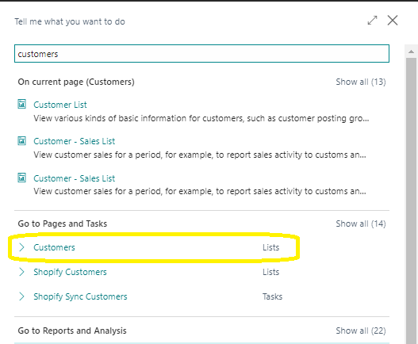
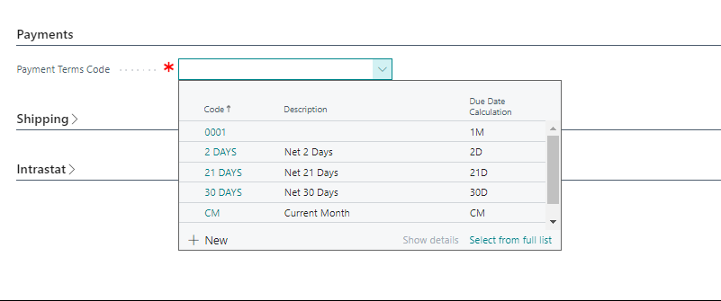
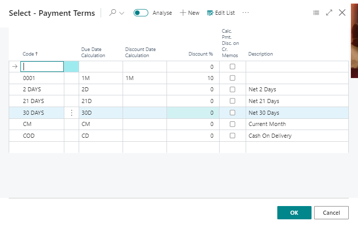
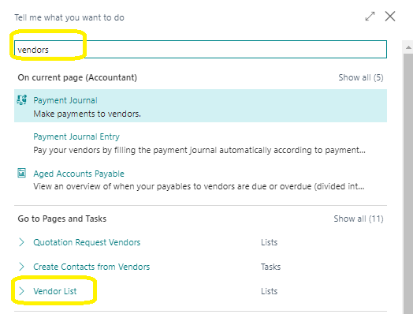

# Setting Up Customers and Vendors
---

    
Managing your **customer** and **vendor** data in cash management helps to keep your company's finances in check. The **Payments FastTab** on both the **customer** and **vendor cards** holds key fields related to cash management, such as **payment terms** and **methods**, making it easier for you to handle your data effectively.

---

### Setting Up Customers
---

To set up a **customer** in cash management, here's what you need to do:

1. Click the **Search for Page** icon in the top-right corner, type in "**customers**," and hit enter.

2. Open the **customer card** of the **customer** you're working with.

3. Expand the **Payments FastTab** and select **Show more** to see all fields.

---

4. Fill in the necessary fields. Click on a field for a short description or follow the link for more information.

One crucial field on the **Payments FastTab** is the **Payment Terms** field, which helps calculate invoice and credit memo due dates.

---

### Setting Up Payment Terms
---

To set up a **payment term**, follow these steps:

1. Click the **Search for Page** icon in the top-right corner, type in "**payment terms**," and select the related link.
2. Enter a code to identify the **payment term** in the **Code field**.
3. Specify the formula used to calculate the payment due date.
4. If applicable, enter a date formula for the discount date calculation in the **Discount Date Calculation field**.
5. If there's a payment discount, enter the percentage in the **Discount % field**.
6. Optionally, select **Calc. Pmt. Disc. on Cr. Memos** if you want to calculate payment discounts on credit memos.
7. Add a description for the payment discount in the **Description field**.

---

### Setting Up Vendors
---

Now, let's set up a **vendor** in cash management:

1. Click the **Search for Page** icon in the top-right corner, type in "**vendors**," and select the related link.

2. Open the **vendor card** of the **vendor** you're working with.

<!-- 3. Expand the **Payments FastTab** and select **Show more** to display all fields.
4. Fill in the necessary fields. Click on a field for a short description or follow the link for more information. -->

---

:::note 
- Since **vendors** are often involved in payment journals, you might also need to enter **vendor bank accounts**.
:::

---
