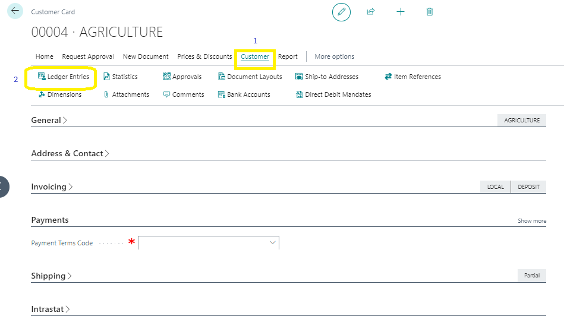
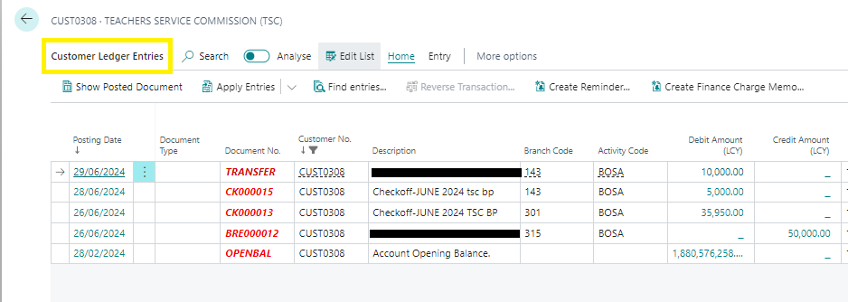
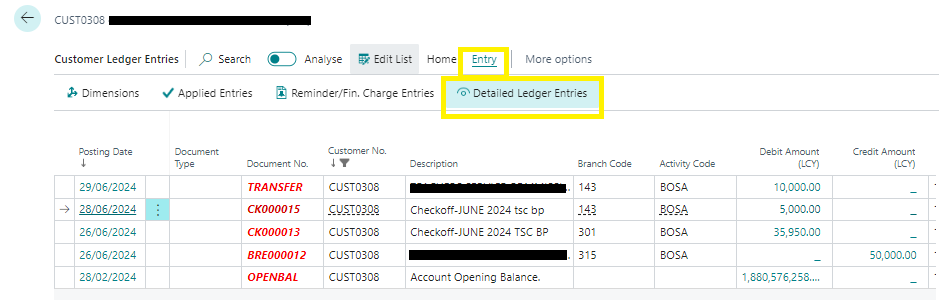

# Relationship Between Customer and Customer Ledger Entries
---

In Business Central, when you post transactions to customers, two main types of customer entries are generated:

- **Customer Ledger Entries**
- **Detailed Customer Ledger Entries**

---

### Customer Ledger Entries
---

Customer entries provide detailed information about customers and sales business. They are generated from sales documents such as sales orders, sales invoices, and journals like cash receipt journals.

To access customer ledger entries for a specific customer:

1. Click the **Search for Page** icon in the top-right corner, type in "customers," and select the related link.
2. Choose a customer and open their customer card by selecting the No. field.
3. Select **Related**, then **History**, and finally **Ledger Entries**.

---

---

Alternatively, you can select one of the amount fields on the customer list or customer card, such as the **Balance (LCY) field**.

---

### Detailed Customer Ledger Entries

---

Detailed customer ledger entries contain precise information about customer transactions, such as invoices. They store actual amounts and are represented as **FlowFields**.

To explore detailed customer ledger entries:

1. Select a customer ledger entry.
2. Choose **Entry**, then **Detailed Ledger Entries**.

Additional detailed customer ledger entries are created to accommodate changes to the customer ledger entries, including:

- Foreign currency exchange rates
- Payment discounts
- Payment tolerances
- Applications
- Rounding

---

Understanding the relationship between these entries helps you gain insights into your customer transactions and maintain accurate financial records.

---
