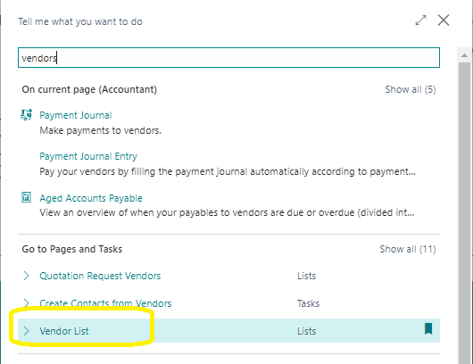
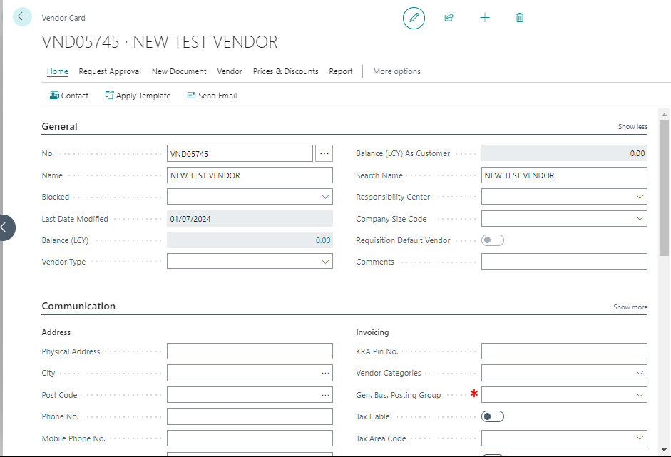
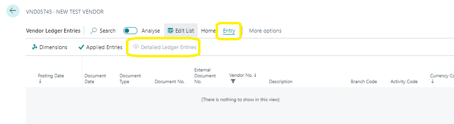

# Understanding Vendor and Vendor Ledger Entries in Business Central
---

    
Welcome to the guide on understanding the relationship between vendor and vendor ledger entries in Business Central. This user manual will help you navigate and comprehend the entries created when posting transactions to vendors. By the end of this guide, you'll be able to access and interpret both vendor ledger entries and detailed vendor ledger entries.

---

### What Happens When You Post Vendor Transactions?
---

When you post transactions to vendors in Business Central, two types of vendor entries are created:

- **Vendor Ledger Entries**
- **Detailed Vendor Ledger Entries**

These entries provide essential information about your vendors and your purchase transactions with them.

### Exploring Vendor Ledger Entries
---

Vendor ledger entries are generated from various purchase documents, such as purchase orders, purchase invoices, and journals like payment journals. These entries give you a comprehensive view of your vendor transactions.

### How to Access Vendor Ledger Entries
---

1. **Search for Vendors**
    - Select the **Search for Page** icon in the top-right corner.
    - Enter **Vendors** and select the related link.

    

2. **Open Vendor Card**
    - Choose a vendor and open their vendor card by selecting the **No.** field.

    

3. **Navigate to Ledger Entries**
    - Select **Related**, then **History**, and finally **Ledger Entries**.

    

    Alternatively, you can select one of the amount fields on the vendor list or vendor card, such as the **Balance (LCY)** field.

<!--  -->

### Exploring Detailed Vendor Ledger Entries
---

Detailed vendor ledger entries provide a deeper look into each vendor transaction, showing the actual amounts involved, such as invoices. These entries are represented as FlowFields in the vendor ledger entries.

### How to Access Detailed Vendor Ledger Entries
---

1. **Select a Vendor Ledger Entry**
    - From the vendor ledger entries, choose a specific entry.

2. **View Detailed Entries**
    - Select **Entry**, then **Detailed Ledger Entries**.

<!--  -->

### Why Detailed Vendor Ledger Entries Matter
---

Detailed vendor ledger entries are crucial for understanding the specifics of each transaction. They record the actual transaction amounts and can include additional entries for:

- Foreign currency exchange rates
- Payment discounts
- Payment tolerances
- Applications
- Rounding

By following this guide, you should now be able to access and understand both vendor and detailed vendor ledger entries in Business Central. This knowledge is vital for managing your vendor transactions effectively and ensuring accurate financial records.

---
