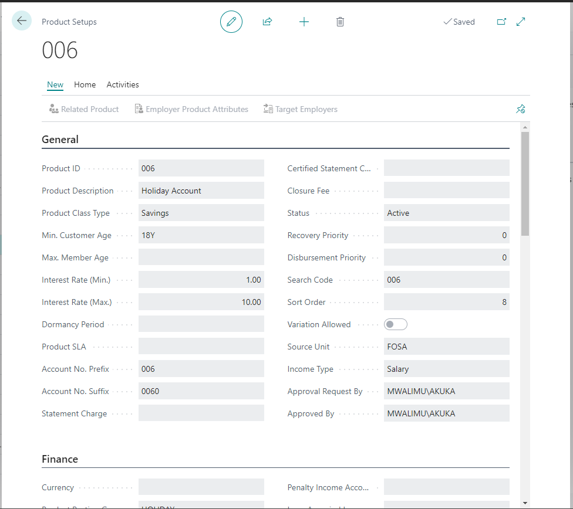

# Product Applications
---

    
 Welcome to the **Product Applications** guide for **Microsoft Dynamics 365 Business Central** users. This document is crafted to assist you in managing product applications effectively within the Business Central platform. It will guide you through creating, analyzing, and approving product applications with ease: 🤗 

---

## **Getting Started with Business Central**
---

First, ensure you're logged into **Microsoft Dynamics 365 Business Central** with your organizational credentials. From the **ICT Role Center**, navigate to the **Product Applications** section to begin.

:::tip Key Functionalities Overview
---

- **Search:** Leverage Business Central's search capabilities to locate specific product applications swiftly.
- **Analyze:** Utilize analytics and reporting tools for deeper insights into your product applications.
- **New:** Easily initiate the creation of new product applications.
- **Activities Tab:** Your go-to hub for all related documents, approval workflows, and more.

---

:::

## **Step-by-Step Guide**
---

### **Creating a New Product Application**
---

#### **1. Initiate a New Application:**
   - From the interface, select **"New"** to open the **Product Setup Card**—your gateway to entering new product application details.
  
  
  
   - Populate the **Product Setup Card** with necessary details such as product name, category, and specifications.

#### **2. Save Your Progress:**
   - Click **"Save"** after filling in the details to create the new product application within the system.

---

:::info **Navigating the Activities Tab**

---

#### **1. Accessing the Navigation Bar:**
   - Find the navigation bar, typically positioned at the top or side of the Business Central interface.
   - Select the **"Activities"** tab to manage all activities related to product applications.

:::

### **Document and Approval Management**
---

#### **1. Working with Documents:**
---
   - Under the **"Activities"** tab, manage your product application documents—view, upload, or download as needed.

#### **2. Handling Approval Requests:**
---
   - To send an approval request, pick the relevant product application and opt to send it to the designated approver.
   - Approval requests can be canceled before processing if updates or corrections are needed.

#### **3. Checking Approvals:**
---
   - Monitor the status of approval requests to keep track of which applications are approved, pending, or require attention.

#### **4. Reopening Applications:**
---
   - Applications can be reopened for amendments or additional information, ensuring everything is correct before final approval.

The **Product Applications** section in **Microsoft Dynamics 365 Business Central** is designed to make the management of product applications as streamlined as possible. By following this guide, you can navigate the creation, management, and approval processes efficiently. For further assistance or detailed inquiries, please refer to the **Help** section within Business Central or contact your system administrator.

---
