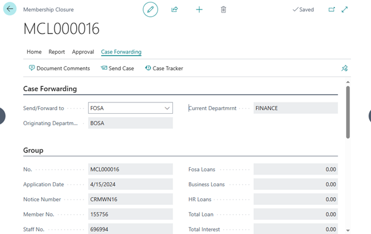
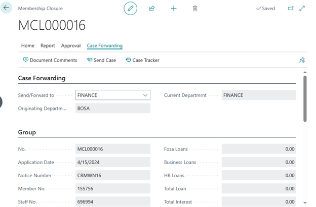
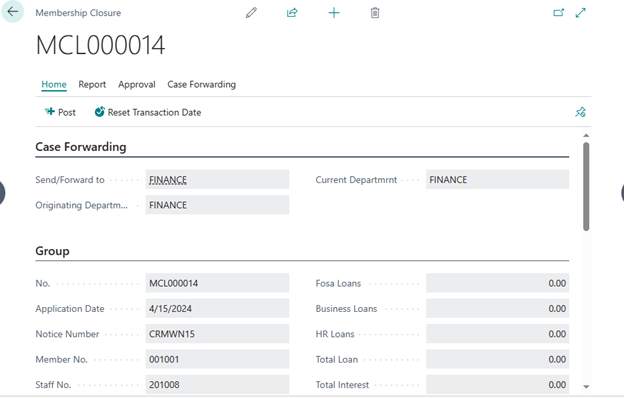

# Member Withdrawal Process
---

    
 The Member Withdrawal Process outlines the steps for members to exit and withdraw from their membership, with balances paid accordingly. This process involves coordination between various role centers including Credit/BOSA, FOSA, and Finance.

---

### Credit/BOSA Role Center
---

1. **Navigate to Periodic Activities**
   - Access the **Member Withdrawal Notices** section.

2. **Open Withdrawal Notices**
   - Review all open withdrawal notices.
   - Open a record to access the member withdrawal card.
   - Add comments in the CRM Actions tab if needed and send back to CRM for corrections.
   - Approve the case and request approval if necessary in the Approvals tab.
   - Create membership closure in the Home tab.

3. **Approved Withdrawal Notices**
   - Access all approved withdrawal notices.

4. **Processed Withdrawal Notices**
   - Review all processed withdrawal notices.

5. **Rejected Withdrawal Notices**
   - View all rejected withdrawal notices.

6. **Notices Returned to CRM**
   - Access all notices sent back to CRM.

7. **Navigate to Member Closure**
   - Access the open closure list.
   - Select a record to access the member closure card.
   - Forward the case to FOSA in the Case Forwarding tab.

   

---

### FOSA Role Center
---

1. **Navigate to Accounts Tab**
   - Locate **Member Withdrawal** subsection.

2. **Open Withdrawal Notices**
   - Review all open notices.
   - Access the member withdrawal card.
   - Add comments in the CRM Actions tab if needed and send back to BOSA CRM for corrections.
   - Approve the case and request approval if necessary in the Approvals tab.

3. **Approved Withdrawal Notices**
   - Access all approved withdrawal notices.

4. **Processed Withdrawal Notices**
   - Review all processed withdrawal notices.

5. **Rejected Withdrawal Notices**
   - View all rejected withdrawal notices.

6. **Notices Returned to CRM**
   - Access all notices sent back to CRM.

7. **Member Closure**
   - Access the open, pending, approved, or rejected closure list.
   - Open a record to access the member closure card.
   - Forward the case to Business Loans/Finance in the Case Forwarding tab.

   

### Finance Role Center
---

1. **Navigate to Member Section**
   - Access the **Member Closure** section.

2. **Open Closure List**
   - Review all open closure notices.
   - Access the membership closure card.
   - Post transactions in the Home tab.

3. **Approved Closure List**
   - Access all approved closures.

4. **Posted Closure List**
   - Review all processed closures.

5. **Rejected Closure List**
   - View all rejected closures.

6. **Member Details**
   - Navigate to **Member Single.**
   - Filter by member and access the posted report under **Member Detailed Statement.**

---

Follow these steps diligently to ensure smooth processing of member withdrawals and closures.

